## 控制评论按钮隐藏 <!-- {docsify-ignore-all} -->

   获取部件状态信息，通过直接赋值，控制指定部件显示隐藏

### 处理过程

```plantuml
@startuml
hide footbox
<style>
root {
  HyperlinkColor #42b983
}
</style>

hide empty description
state "开始" as Begin <<start>> [[$./comment_icon_hidden#begin {开始}]]
state "获取部件状态信息" as PREPAREJSPARAM1  [[$./comment_icon_hidden#preparejsparam1 {获取部件状态信息}]]
state "控制部件显示隐藏" as PREPAREJSPARAM2  [[$./comment_icon_hidden#preparejsparam2 {控制部件显示隐藏}]]


Begin --> PREPAREJSPARAM1
PREPAREJSPARAM1 --> PREPAREJSPARAM2


@enduml
```

### 处理步骤说明

#### 开始 :id=Begin [开始]

#### 获取部件状态信息 :id=PREPAREJSPARAM1 [准备参数]

1. 将`view(视图).layoutPanel.panelItems.comment_send.state` 设置给  `send(评论)`
2. 将`view(视图).layoutPanel.panelItems.comment_cancel.state` 设置给  `reset(清空)`
3. 将`view(视图).layoutPanel.panelItems.comment_icon.state` 设置给  `icon(图标)`

#### 控制部件显示隐藏 :id=PREPAREJSPARAM2 [准备参数]

1. 将`view(视图).layoutPanel.panelItems.field_textbox.value?true:false` 设置给  `send(评论).visible`
2. 将`view(视图).layoutPanel.panelItems.field_textbox.value?true:false` 设置给  `reset(清空).visible`
3. 将`view(视图).layoutPanel.panelItems.field_textbox.value?false:true` 设置给  `icon(图标).visible`

### 实体逻辑参数

|    中文名   |    代码名    |  数据类型      |备注 |
| --------| --------| --------  | --------   |
|视图|view|当前视图对象||
|评论|send|数据对象||
|图标|icon|数据对象||
|清空|reset|数据对象||
|传入变量(<i class="fa fa-check"/></i>)|Default|数据对象||
