## 控制评论按钮显示（知识库） <!-- {docsify-ignore-all} -->

   知识库评论按钮显示

### 处理过程

```plantuml
@startuml
hide footbox
<style>
root {
  HyperlinkColor #42b983
}
</style>

hide empty description
state "开始" as Begin <<start>> [[$./comment_icon_show_wiki#begin {开始}]]
state "控制评论按钮显示（知识库）" as RAWJSCODE1  [[$./comment_icon_show_wiki#rawjscode1 {控制评论按钮显示（知识库）}]]


Begin --> RAWJSCODE1


@enduml
```




### 处理步骤说明

#### 开始 :id=Begin<sup class="footnote-symbol"> <font color=gray size=1>[开始]</font></sup>


#### 控制评论按钮显示（知识库） :id=RAWJSCODE1<sup class="footnote-symbol"> <font color=gray size=1>[直接前台代码]</font></sup>


<p class="panel-title"><b>执行代码</b></p>

```javascript
uiLogic.send = uiLogic.view.layoutPanel.panelItems.container_singledata.panelItems.comment_send.state;
uiLogic.reset = uiLogic.view.layoutPanel.panelItems.container_singledata.panelItems.comment_cancel.state;
uiLogic.icon = uiLogic.view.layoutPanel.panelItems.container_singledata.panelItems.comment_icon.state;
uiLogic.icon.visible = false;
uiLogic.send.visible = uiLogic.context.srfreadonly !== true;
uiLogic.reset.visible = uiLogic.context.srfreadonly !== true;
```


### 实体逻辑参数

|    中文名   |    代码名    |  数据类型      |备注 |
| --------| --------| --------  | --------   |
|传入变量(<i class="fa fa-check"/></i>)|Default|数据对象||
|上下文|context|导航视图参数绑定参数||
|清空|reset|数据对象||
|图标|icon|数据对象||
|视图|view|当前视图对象||
|评论|send|数据对象||
