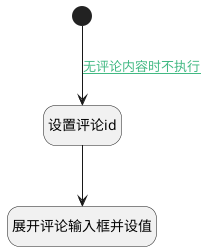

## 编辑评论 <!-- {docsify-ignore-all} -->

   编辑评论，获取评论数据，展开评论输入框并赋值

### 处理过程




### 处理步骤说明

#### 开始 :id=Begin<sup class="footnote-symbol"> <font color=gray size=1>[开始]</font></sup>


#### 设置评论id :id=PREPAREJSPARAM1<sup class="footnote-symbol"> <font color=gray size=1>[准备参数]</font></sup>


1. 将`view(当前视图对象).parentView` 设置给  `parentView(父视图对象)`
2. 将`空值（NULL）` 设置给  `parentView(父视图对象).reply_comment_id`
3. 将`parentView(父视图对象).layoutPanel.panelItems.field_textbox.editor` 设置给  `comment(评论对象)`
4. 将`Default(传入变量).id` 设置给  `parentView(父视图对象).edit_comment_id`

#### 展开评论输入框并设值 :id=RAWJSCODE1<sup class="footnote-symbol"> <font color=gray size=1>[直接前台代码]</font></sup>


<p class="panel-title"><b>执行代码</b></p>

```javascript
uiLogic.comment.toggleCollapse(true);
uiLogic.comment.setValue(uiLogic.default.content);
uiLogic.comment.reply.value = null;
```

### 连接条件说明
#### 无评论内容时不执行 :id=Begin-PREPAREJSPARAM1

```Default(传入变量).content``` ISNOTNULL


### 实体逻辑参数

|    中文名   |    代码名    |  数据类型      |备注 |
| --------| --------| --------  | --------   |
|评论对象|comment|数据对象||
|传入变量(<i class="fa fa-check"/></i>)|Default|数据对象||
|父视图对象|parentView|数据对象||
|当前视图对象|view|当前视图对象||
|评论id存储对象|comment_id|数据对象||
