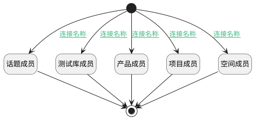

## 打开人员选择视图（移动端） <!-- {docsify-ignore-all} -->

   

### 处理过程




### 处理步骤说明

#### 开始 :id=Begin<sup class="footnote-symbol"> <font color=gray size=1>[开始]</font></sup>


#### 产品成员 :id=DEUIACTION1<sup class="footnote-symbol"> <font color=gray size=1>[实体界面行为调用]</font></sup>


调用实体 [产品成员(PRODUCT_MEMBER)](module/ProdMgmt/product_member.md) 界面行为 [打开人员选择视图（移动端）](module/ProdMgmt/product_member#界面行为) ，行为参数为`Default(传入变量)`

#### 项目成员 :id=DEUIACTION2<sup class="footnote-symbol"> <font color=gray size=1>[实体界面行为调用]</font></sup>


调用实体 [项目成员(PROJECT_MEMBER)](module/ProjMgmt/project_member.md) 界面行为 [打开人员选择视图（移动端）](module/ProjMgmt/project_member#界面行为) ，行为参数为`Default(传入变量)`

#### 空间成员 :id=DEUIACTION3<sup class="footnote-symbol"> <font color=gray size=1>[实体界面行为调用]</font></sup>


调用实体 [空间成员(SPACE_MEMBER)](module/Wiki/space_member.md) 界面行为 [打开人员选择视图（移动端）](module/Wiki/space_member#界面行为) ，行为参数为`Default(传入变量)`

#### 测试库成员 :id=DEUIACTION4<sup class="footnote-symbol"> <font color=gray size=1>[实体界面行为调用]</font></sup>


调用实体 [测试库成员(LIBRARY_MEMBER)](module/TestMgmt/library_member.md) 界面行为 [打开人员选择视图（移动端）](module/TestMgmt/library_member#界面行为) ，行为参数为`Default(传入变量)`

#### 话题成员 :id=DEUIACTION5<sup class="footnote-symbol"> <font color=gray size=1>[实体界面行为调用]</font></sup>


调用实体 [协作成员(DISCUSS_MEMBER)](module/Team/discuss_member.md) 界面行为 [打开人员选择视图（移动端）](module/Team/discuss_member#界面行为) ，行为参数为`Default(传入变量)`

#### 结束 :id=END1<sup class="footnote-symbol"> <font color=gray size=1>[结束]</font></sup>


### 连接条件说明
#### 连接名称 :id=Begin-DEUIACTION1

```ctx(ctx).product``` ISNOTNULL AND ```ctx(ctx).project``` ISNULL AND ```ctx(ctx).space``` ISNULL AND ```ctx(ctx).library``` ISNULL AND ```ctx(ctx).discuss_topic``` ISNULL
#### 连接名称 :id=Begin-DEUIACTION2

```ctx(ctx).project``` ISNOTNULL AND ```ctx(ctx).product``` ISNULL AND ```ctx(ctx).space``` ISNULL AND ```ctx(ctx).library``` ISNULL AND ```ctx(ctx).discuss_topic``` ISNULL
#### 连接名称 :id=Begin-DEUIACTION3

```ctx(ctx).project``` ISNULL AND ```ctx(ctx).product``` ISNULL AND ```ctx(ctx).library``` ISNULL AND ```ctx(ctx).discuss_topic``` ISNULL AND (```ctx(ctx).article_page``` ISNOTNULL OR ```ctx(ctx).space``` ISNOTNULL)
#### 连接名称 :id=Begin-DEUIACTION4

```ctx(ctx).library``` ISNOTNULL AND ```ctx(ctx).product``` ISNULL AND ```ctx(ctx).project``` ISNULL AND ```ctx(ctx).space``` ISNULL AND ```ctx(ctx).discuss_topic``` ISNULL
#### 连接名称 :id=Begin-DEUIACTION5

```ctx(ctx).discuss_topic``` ISNOTNULL AND ```ctx(ctx).product``` ISNULL AND ```ctx(ctx).project``` ISNULL AND ```ctx(ctx).space``` ISNULL AND ```ctx(ctx).library``` ISNULL


### 实体逻辑参数

|    中文名   |    代码名    |  数据类型      |备注 |
| --------| --------| --------  | --------   |
|传入变量(<i class="fa fa-check"/></i>)|Default|数据对象||
|ctx|ctx|导航视图参数绑定参数||
