## 刷新评论列表（移动端） <!-- {docsify-ignore-all} -->

   刷新

### 处理过程

```plantuml
@startuml
hide footbox
<style>
root {
  HyperlinkColor #42b983
}
</style>

hide empty description
state "开始" as Begin <<start>> [[$./refresh_comment#begin {开始}]]
state "注入脚本代码" as RAWJSCODE1  [[$./refresh_comment#rawjscode1 {注入脚本代码}]]
state "准备参数" as PREPAREJSPARAM1  [[$./refresh_comment#preparejsparam1 {准备参数}]]


Begin --> PREPAREJSPARAM1 : [[$./refresh_comment#begin-preparejsparam1{连接名称} 连接名称]]
PREPAREJSPARAM1 --> RAWJSCODE1


@enduml
```




### 处理步骤说明

#### 开始 :id=Begin<sup class="footnote-symbol"> <font color=gray size=1>[开始]</font></sup>


#### 准备参数 :id=PREPAREJSPARAM1<sup class="footnote-symbol"> <font color=gray size=1>[准备参数]</font></sup>


1. 将`<p><del>该评论已删除</del></p>` 设置给  `Default(传入变量).CONTENT`

#### 注入脚本代码 :id=RAWJSCODE1<sup class="footnote-symbol"> <font color=gray size=1>[直接前台代码]</font></sup>


<p class="panel-title"><b>执行代码</b></p>

```javascript
ibiz.hub.getApp(context.srfappid).deService.exec(
'plmmob.comment',
'Update',
context,
uiLogic.Default,
);
```

### 连接条件说明
#### 连接名称 :id=Begin-PREPAREJSPARAM1

```ctx(ctx).principal_type``` EQ ```discuss_post```


### 实体逻辑参数

|    中文名   |    代码名    |  数据类型      |备注 |
| --------| --------| --------  | --------   |
|传入变量(<i class="fa fa-check"/></i>)|Default|数据对象||
|ctx|ctx|导航视图参数绑定参数||
