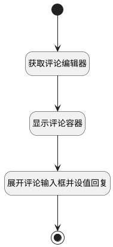

## 回复评论（知识库）(客户沟通) <!-- {docsify-ignore-all} -->

   获取回复对象评论信息，并展开评论输入框，显示回复组件

### 处理过程




### 处理步骤说明

#### 开始 :id=Begin<sup class="footnote-symbol"> <font color=gray size=1>[开始]</font></sup>


#### 获取评论编辑器 :id=PREPAREJSPARAM1<sup class="footnote-symbol"> <font color=gray size=1>[准备参数]</font></sup>


1. 将`view(当前视图对象).parentView` 设置给  `parentView(父视图)`
2. 将`parentView(父视图).layoutPanel.panelItems.client_field_textbox.editor` 设置给  `comment(评论对象)`

#### 显示评论容器 :id=DEUIACTION1<sup class="footnote-symbol"> <font color=gray size=1>[实体界面行为调用]</font></sup>


调用实体 [评论(COMMENT)](module/Base/comment.md) 界面行为 [添加回复（客户沟通）](module/Base/comment#界面行为) 

#### 展开评论输入框并设值回复 :id=RAWJSCODE1<sup class="footnote-symbol"> <font color=gray size=1>[直接前台代码]</font></sup>


<p class="panel-title"><b>执行代码</b></p>

```javascript
const _app = ibiz.hub.getApp(context.srfappid);
_app.codeList.get('SysOperator', context, params).then(items => {
	const create_man = uiLogic.default.create_man;
	const findItem = items.find(item => item.value == create_man);
	const name = findItem ? findItem.text : create_man;
	const content = uiLogic.default.content;
	uiLogic.comment.setReply({name, content});
	uiLogic.comment.toggleCollapse(true);
})
uiLogic.view.edit_comment_id='';
uiLogic.view.reply_comment_id=uiLogic.default.id;
```

#### 结束 :id=END1<sup class="footnote-symbol"> <font color=gray size=1>[结束]</font></sup>


### 实体逻辑参数

|    中文名   |    代码名    |  数据类型      |备注 |
| --------| --------| --------  | --------   |
|当前视图对象|view|当前视图对象||
|评论对象|comment|数据对象||
|父视图|parentView|数据对象||
|传入变量(<i class="fa fa-check"/></i>)|Default|数据对象||
