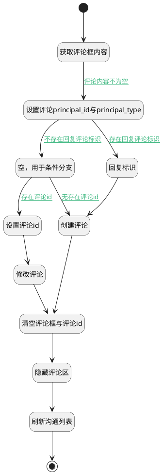

## 发送评论(客户沟通) <!-- {docsify-ignore-all} -->

   发送评论，并关闭评论输入框，刷新评论列表

### 处理过程




### 处理步骤说明

#### 开始 :id=Begin<sup class="footnote-symbol"> <font color=gray size=1>[开始]</font></sup>


#### 获取评论框内容 :id=RAWJSCODE1<sup class="footnote-symbol"> <font color=gray size=1>[直接前台代码]</font></sup>


<p class="panel-title"><b>执行代码</b></p>

```javascript
uiLogic.comment.content = uiLogic.view.layoutPanel.panelItems.client_field_textbox.value;
```

#### 设置评论principal_id与principal_type :id=PREPAREJSPARAM1<sup class="footnote-symbol"> <font color=gray size=1>[准备参数]</font></sup>


1. 将`ctx(应用上下文变量).principal_id` 设置给  `comment(评论对象).principal_id`
2. 将`CUSTOMER_CONNECT` 设置给  `comment(评论对象).principal_type`
3. 将`view(当前视图对象).layoutPanel.panelItems.client_field_textbox.editor` 设置给  `editor(编辑器)`
4. 将`CUSTOMER_CONNECT` 设置给  `comment(评论对象).owner_type`

#### 空，用于条件分支 :id=PREPAREJSPARAM4<sup class="footnote-symbol"> <font color=gray size=1>[准备参数]</font></sup>


    无

#### 回复标识 :id=PREPAREJSPARAM2<sup class="footnote-symbol"> <font color=gray size=1>[准备参数]</font></sup>


1. 将`commentcustomer_connect_list_view(嵌入客户沟通视图).reply_comment_id` 设置给  `comment(评论对象).pid`

#### 创建评论 :id=DEACTION2<sup class="footnote-symbol"> <font color=gray size=1>[实体行为]</font></sup>


调用实体 [评论(COMMENT)](module/Base/comment.md) 行为 [Create](module/Base/comment#行为) ，行为参数为`comment(评论对象)`

#### 设置评论id :id=PREPAREJSPARAM3<sup class="footnote-symbol"> <font color=gray size=1>[准备参数]</font></sup>


1. 将`commentcustomer_connect_list_view(嵌入客户沟通视图).edit_comment_id` 设置给  `comment(评论对象).id`
2. 将`commentcustomer_connect_list_view(嵌入客户沟通视图).edit_comment_id` 设置给  `ctx(应用上下文变量).comment`

#### 修改评论 :id=DEACTION3<sup class="footnote-symbol"> <font color=gray size=1>[实体行为]</font></sup>


调用实体 [评论(COMMENT)](module/Base/comment.md) 行为 [Update](module/Base/comment#行为) ，行为参数为`comment(评论对象)`

#### 结束 :id=END1<sup class="footnote-symbol"> <font color=gray size=1>[结束]</font></sup>


#### 刷新沟通列表 :id=RAWJSCODE4<sup class="footnote-symbol"> <font color=gray size=1>[直接前台代码]</font></sup>


<p class="panel-title"><b>执行代码</b></p>

```javascript
ibiz.mc.command.update.send({ srfdecodename: 'ticket'})
```

#### 隐藏评论区 :id=RAWJSCODE3<sup class="footnote-symbol"> <font color=gray size=1>[直接前台代码]</font></sup>


<p class="panel-title"><b>执行代码</b></p>

```javascript
const panelItems = view.layoutPanel.panelItems;
panelItems.client_panel_container.state.visible = false;
```

#### 清空评论框与评论id :id=RAWJSCODE2<sup class="footnote-symbol"> <font color=gray size=1>[直接前台代码]</font></sup>


<p class="panel-title"><b>执行代码</b></p>

```javascript
uiLogic.view.layoutPanel.panelItems.client_field_textbox.value = '';
uiLogic.view.layoutPanel.panelItems.client_field_textbox.data.client_field_textbox = '';
uiLogic.commentcustomer_connect_list_view.edit_comment_id = null;
uiLogic.commentcustomer_connect_list_view.reply_comment_id = null;
uiLogic.editor.reply.value = null;
```

### 连接条件说明
#### 评论内容不为空 :id=RAWJSCODE1-PREPAREJSPARAM1

```comment(评论对象).content``` ISNOTNULL
#### 不存在回复评论标识 :id=PREPAREJSPARAM1-PREPAREJSPARAM4

```editor(编辑器).reply.value``` ISNULL
#### 无存在评论id :id=PREPAREJSPARAM4-DEACTION2

```commentcustomer_connect_list_view(嵌入客户沟通视图).edit_comment_id``` ISNULL
#### 存在评论id :id=PREPAREJSPARAM4-PREPAREJSPARAM3

```commentcustomer_connect_list_view(嵌入客户沟通视图).edit_comment_id``` ISNOTNULL
#### 存在回复评论标识 :id=PREPAREJSPARAM1-PREPAREJSPARAM2

```editor(编辑器).reply.value``` ISNOTNULL


### 实体逻辑参数

|    中文名   |    代码名    |  数据类型      |备注 |
| --------| --------| --------  | --------   |
|表单|form|部件对象||
|应用上下文变量|ctx|导航视图参数绑定参数||
|评论对象|comment|数据对象||
|编辑器|editor|数据对象||
|传入变量(<i class="fa fa-check"/></i>)|Default|数据对象||
|嵌入客户沟通视图|commentcustomer_connect_list_view|部件对象||
|当前视图对象|view|当前视图对象||
