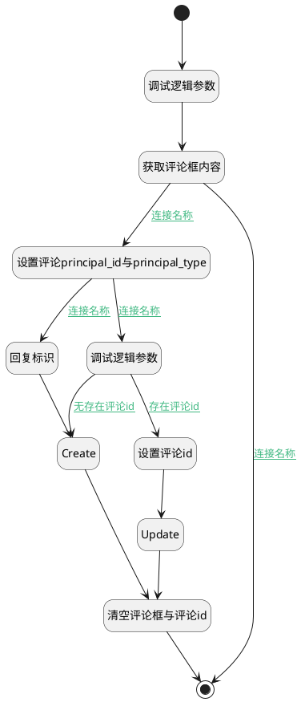

## 发送评论测试 <!-- {docsify-ignore-all} -->

   

### 处理过程




### 处理步骤说明

#### 开始 :id=Begin<sup class="footnote-symbol"> <font color=gray size=1>[开始]</font></sup>


#### 调试逻辑参数 :id=DEBUGPARAM2<sup class="footnote-symbol"> <font color=gray size=1>[调试逻辑参数]</font></sup>


> [!NOTE|label:调试信息|icon:fa fa-bug]
> 调试输出参数`当前视图对象`的详细信息

#### 获取评论框内容 :id=RAWJSCODE1<sup class="footnote-symbol"> <font color=gray size=1>[直接前台代码]</font></sup>


<p class="panel-title"><b>执行代码</b></p>

```javascript
uiLogic.comment.content = 
uiLogic.view.layoutPanel.
panelItems.container_grid.panel.panelItemsfield_textbox.value;
```

#### 设置评论principal_id与principal_type :id=PREPAREJSPARAM1<sup class="footnote-symbol"> <font color=gray size=1>[准备参数]</font></sup>


1. 将`ctx(应用上下文变量).principal_id` 设置给  `comment(评论对象).principal_id`
2. 将`view(当前视图对象).layoutPanel.panelItems.field_textbox.editor` 设置给  `editor(编辑器)`
3. 将`ctx(应用上下文变量).principal_type` 设置给  `comment(评论对象).principal_type`

#### 调试逻辑参数 :id=DEBUGPARAM1<sup class="footnote-symbol"> <font color=gray size=1>[调试逻辑参数]</font></sup>


> [!NOTE|label:调试信息|icon:fa fa-bug]
> 调试输出参数`当前视图对象`的详细信息

#### 回复标识 :id=PREPAREJSPARAM2<sup class="footnote-symbol"> <font color=gray size=1>[准备参数]</font></sup>


1. 将`view(当前视图对象).reply_comment_id` 设置给  `comment(评论对象).pid`

#### 设置评论id :id=PREPAREJSPARAM3<sup class="footnote-symbol"> <font color=gray size=1>[准备参数]</font></sup>


1. 将`view(当前视图对象).edit_comment_id` 设置给  `comment(评论对象).id`
2. 将`view(当前视图对象).edit_comment_id` 设置给  `ctx(应用上下文变量).comment`

#### Create :id=DEACTION2<sup class="footnote-symbol"> <font color=gray size=1>[实体行为]</font></sup>


调用实体 [评论(COMMENT)](module/Base/comment.md) 行为 [Create](module/Base/comment#行为) ，行为参数为`comment(评论对象)`

#### Update :id=DEACTION3<sup class="footnote-symbol"> <font color=gray size=1>[实体行为]</font></sup>


调用实体 [评论(COMMENT)](module/Base/comment.md) 行为 [Update](module/Base/comment#行为) ，行为参数为`comment(评论对象)`

#### 结束 :id=END1<sup class="footnote-symbol"> <font color=gray size=1>[结束]</font></sup>


#### 清空评论框与评论id :id=RAWJSCODE2<sup class="footnote-symbol"> <font color=gray size=1>[直接前台代码]</font></sup>


<p class="panel-title"><b>执行代码</b></p>

```javascript
uiLogic.view.layoutPanel.panelItems.field_textbox.value = '';
uiLogic.view.layoutPanel.panelItems.field_textbox.data.field_textbox = '';
uiLogic.view.edit_comment_id = null;
uiLogic.view.reply_comment_id = null;
uiLogic.editor.reply.value = null;
```

### 连接条件说明
#### 连接名称 :id=RAWJSCODE1-PREPAREJSPARAM1

```comment(评论对象).content``` ISNOTNULL
#### 连接名称 :id=PREPAREJSPARAM1-DEBUGPARAM1

```editor(编辑器).reply.value``` ISNULL
#### 无存在评论id :id=DEBUGPARAM1-DEACTION2

```view(当前视图对象).edit_comment_id``` ISNULL
#### 存在评论id :id=DEBUGPARAM1-PREPAREJSPARAM3

```view(当前视图对象).edit_comment_id``` ISNOTNULL
#### 连接名称 :id=PREPAREJSPARAM1-PREPAREJSPARAM2

```editor(编辑器).reply.value``` ISNOTNULL
#### 连接名称 :id=RAWJSCODE1-END1

```comment(评论对象).content``` ISNULL


### 实体逻辑参数

|    中文名   |    代码名    |  数据类型      |备注 |
| --------| --------| --------  | --------   |
|编辑器|editor|数据对象||
|当前视图对象|view|当前视图对象||
|评论对象|comment|数据对象||
|应用上下文变量|ctx|导航视图参数绑定参数||
|传入变量(<i class="fa fa-check"/></i>)|Default|数据对象||
