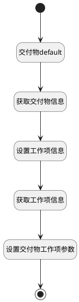

## 获取交付物详情 <!-- {docsify-ignore-all} -->

   

### 处理过程

### 处理步骤说明

#### 开始 :id=Begin [开始]

*- N/A*
#### 交付物default :id=DEBUGPARAM1 [调试逻辑参数]

> [!NOTE|label:调试信息|icon:fa fa-bug]
> 调试输出参数`Default(传入变量)`的详细信息

#### 获取交付物信息 :id=DEACTION1 [实体行为]

调用实体 [附件(ATTACHMENT)](module/Base/attachment.md) 行为 [Get](module/Base/attachment#行为) ，行为参数为`Default(传入变量)`

将执行结果返回给参数`Default(传入变量)`

#### 设置工作项信息 :id=PREPAREPARAM3 [准备参数]

1. 将`Default(传入变量).OWNER_ID(所属数据标识)` 设置给  `work_item(工作项).ID(标识)`

#### 获取工作项信息 :id=DEACTION2 [实体行为]

调用实体 [工作项(WORK_ITEM)](module/ProjMgmt/work_item.md) 行为 [Get](module/ProjMgmt/work_item#行为) ，行为参数为`work_item(工作项)`

将执行结果返回给参数`work_item(工作项)`

#### 设置交付物工作项参数 :id=PREPAREPARAM2 [准备参数]

1. 将`work_item(工作项).TITLE(标题)` 设置给  `Default(传入变量).WORK_ITEM_TITLE(工作项标题)`
2. 将`work_item(工作项).IDENTIFIER(编号)` 设置给  `Default(传入变量).WORK_ITEM_IDENTIFIER(工作项编号)`

#### 结束 :id=END1 [结束]

返回 `Default(传入变量)`

### 实体逻辑参数

|    中文名   |    代码名    |  数据类型    |  实体   |备注 |
| --------| --------| -------- | -------- | --------   |
|传入变量(<i class="fa fa-check"/></i>)|Default|数据对象|[交付物(DELIVERABLE)](module/Base/deliverable.md)||
|交付物|delivery|数据对象|[交付物(DELIVERABLE)](module/Base/deliverable.md)||
|工作项|work_item|数据对象|[工作项(WORK_ITEM)](module/ProjMgmt/work_item.md)||
