## 计算交付物表格列行为状态 <!-- {docsify-ignore-all} -->

   用于动态控制提交和删除行为的禁用状态

### 处理过程

```plantuml
@startuml
hide footbox
<style>
root {
  HyperlinkColor #42b983
}
</style>

hide empty description
state "开始" as Begin <<start>> [[$./calc_grid_column_action_state#begin {开始}]]
state "结束" as END1 <<end>> [[$./calc_grid_column_action_state#end1 {结束}]]
state "计算表格列行为状态" as RAWJSCODE1  [[$./calc_grid_column_action_state#rawjscode1 {计算表格列行为状态}]]


Begin --> RAWJSCODE1
RAWJSCODE1 --> END1


@enduml
```




### 处理步骤说明

#### 开始 :id=Begin<sup class="footnote-symbol"> <font color=gray size=1>[开始]</font></sup>


#### 计算表格列行为状态 :id=RAWJSCODE1<sup class="footnote-symbol"> <font color=gray size=1>[直接前台代码]</font></sup>


<p class="panel-title"><b>执行代码</b></p>

```javascript
setTimeout(() => {
	const rows = uiLogic.grid.state.rows;
	const srfreadonly = context.srfreadonly;
	if (rows && rows.length > 0) {
		rows.forEach(row => {
			const actionColumn = row.uiActionGroupStates.title;
			if (actionColumn && Object.values(actionColumn).length > 0) {
				Object.values(actionColumn).forEach(action => {
                    if(srfreadonly == true){
					    // 提交
					    if (action.uiActionId === 'submit_form@deliverable') {
                            action.disabled = true;
                        }
                        // 删除
					    if (action.uiActionId === 'del_form@deliverable') {
                            action.disabled = true;
                        }
                        // 提交
					    if (action.uiActionId === 'submit@deliverable') {
                            action.visible = false;
                        }
                        // 删除
					    if (action.uiActionId === 'del_grid@deliverable') {
                            action.visible = false;;
                        }
                        // 编辑
					    if (action.uiActionId === 'edit@deliverable') {
                            action.visible = false;;
                        }
					}
				})
			}
		})
	}
}, 1000);
```

#### 结束 :id=END1<sup class="footnote-symbol"> <font color=gray size=1>[结束]</font></sup>


### 实体逻辑参数

|    中文名   |    代码名    |  数据类型      |备注 |
| --------| --------| --------  | --------   |
|传入变量(<i class="fa fa-check"/></i>)|Default|数据对象||
|表格|Grid|当前部件对象||
