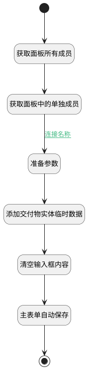

## 新建交付目标 <!-- {docsify-ignore-all} -->

   瀑布项目 → 工作项详情 → 交付物分页 → 新建交付目标按钮

### 处理过程




### 处理步骤说明

#### 开始 :id=Begin<sup class="footnote-symbol"> <font color=gray size=1>[开始]</font></sup>


#### 获取面板所有成员 :id=PREPAREJSPARAM2<sup class="footnote-symbol"> <font color=gray size=1>[准备参数]</font></sup>


1. 将`view(当前视图对象).layoutPanel.panelItems` 设置给  `panelItems(面板成员组)`
2. 将`view(当前视图对象).parentView.layoutPanel.panelItems.form.control` 设置给  `form(主表单对象)`

#### 获取面板中的单独成员 :id=PREPAREJSPARAM3<sup class="footnote-symbol"> <font color=gray size=1>[准备参数]</font></sup>


1. 将`panelItems(面板成员组).container1` 设置给  `container1(容器对象)`
2. 将`panelItems(面板成员组).grid.control` 设置给  `grid(表格对象)`
3. 将`panelItems(面板成员组).input_data` 设置给  `input(输入框)`

#### 准备参数 :id=PREPAREJSPARAM4<sup class="footnote-symbol"> <font color=gray size=1>[准备参数]</font></sup>


1. 将`ctx(应用上下文变量).work_item` 设置给  `deliverable(交付目标对象).owner_id`
2. 将`DELIVERABLE` 设置给  `deliverable(交付目标对象).owner_subtype`
3. 将`WORK_ITEM` 设置给  `deliverable(交付目标对象).owner_type`
4. 将`input(输入框).value` 设置给  `deliverable(交付目标对象).title`

#### 添加交付物实体临时数据 :id=RAWJSCODE1<sup class="footnote-symbol"> <font color=gray size=1>[直接前台代码]</font></sup>


<p class="panel-title"><b>执行代码</b></p>

```javascript
view.layoutPanel.panelItems.grid.state.visible = true;
ibiz.hub.getApp(context.srfappid).deService.exec(
    'plmweb.deliverable',
    'create',
    context,
    uiLogic.deliverable,
);

```

#### 清空输入框内容 :id=PREPAREJSPARAM5<sup class="footnote-symbol"> <font color=gray size=1>[准备参数]</font></sup>


1. 将`空值（NULL）` 设置给  `input(输入框).data.input_data`

#### 主表单自动保存 :id=VIEWCTRLINVOKE1<sup class="footnote-symbol"> <font color=gray size=1>[视图部件调用]</font></sup>


调用`form(主表单对象)`的方法`autoSave`，参数为`form(主表单对象)`
#### 结束 :id=END1<sup class="footnote-symbol"> <font color=gray size=1>[结束]</font></sup>


### 连接条件说明
#### 连接名称 :id=PREPAREJSPARAM3-PREPAREJSPARAM4

```input(输入框)``` NOTEQ ```""```


### 实体逻辑参数

|    中文名   |    代码名    |  数据类型      |备注 |
| --------| --------| --------  | --------   |
|当前视图对象|view|当前视图对象||
|传入变量(<i class="fa fa-check"/></i>)|Default|数据对象||
|应用上下文变量|ctx|导航视图参数绑定参数||
|面板成员组|panelItems|数据对象||
|容器对象|container1|当前容器对象||
|主表单对象|form|部件对象||
|表格对象|grid|部件对象||
|输入框|input|数据对象||
|交付目标对象|deliverable|数据对象||
