## 获取交付目标总条数 <!-- {docsify-ignore-all} -->

   获取交付物的总条数信息

### 处理过程

```plantuml
@startuml
hide footbox
<style>
root {
  HyperlinkColor #42b983
}
</style>

hide empty description
state "开始" as Begin <<start>> [[$./get_deliverable_total#begin {开始}]]
state "注入脚本代码" as RAWJSCODE2  [[$./get_deliverable_total#rawjscode2 {注入脚本代码}]]
state "触发计数器刷新" as RAWJSCODE3  [[$./get_deliverable_total#rawjscode3 {触发计数器刷新}]]
state "结束" as END1 <<end>> [[$./get_deliverable_total#end1 {结束}]]


Begin --> RAWJSCODE2
RAWJSCODE2 --> RAWJSCODE3
RAWJSCODE3 --> END1


@enduml
```




### 处理步骤说明

#### 开始 :id=Begin<sup class="footnote-symbol"> <font color=gray size=1>[开始]</font></sup>


#### 注入脚本代码 :id=RAWJSCODE2<sup class="footnote-symbol"> <font color=gray size=1>[直接前台代码]</font></sup>


<p class="panel-title"><b>执行代码</b></p>

```javascript
uiLogic.view.layoutPanel.panelItems.total.data.total = uiLogic.view.layoutPanel.panelItems.grid.control.state.items.length;
if(uiLogic.view.layoutPanel.panelItems.total.data.total == 0){
    view.layoutPanel.panelItems.grid.state.visible = false
}else{
    view.layoutPanel.panelItems.grid.state.visible = true
}

```

#### 触发计数器刷新 :id=RAWJSCODE3<sup class="footnote-symbol"> <font color=gray size=1>[直接前台代码]</font></sup>


<p class="panel-title"><b>执行代码</b></p>

```javascript
ibiz.mc.command.update.send({ srfdecodename: 'work_item'})
```

#### 结束 :id=END1<sup class="footnote-symbol"> <font color=gray size=1>[结束]</font></sup>


### 实体逻辑参数

|    中文名   |    代码名    |  数据类型      |备注 |
| --------| --------| --------  | --------   |
|当前视图对象|VIEW|当前视图对象||
|交付物列表|deliverable|数据对象列表||
|传入变量(<i class="fa fa-check"/></i>)|Default|数据对象||
|当前部件对象|CTRL|当前部件对象||
