## 主表单保存 <!-- {docsify-ignore-all} -->

   

### 处理过程

```plantuml
@startuml
hide footbox
<style>
root {
  HyperlinkColor #42b983
}
</style>

hide empty description
state "开始" as Begin <<start>> [[$./main_form_save#begin {开始}]]
state "结束" as END1 <<end>> [[$./main_form_save#end1 {结束}]]
state "调用主表单自动保存" as VIEWCTRLINVOKE1  [[$./main_form_save#viewctrlinvoke1 {调用主表单自动保存}]]
state "绑定表单" as PREPAREJSPARAM1  [[$./main_form_save#preparejsparam1 {绑定表单}]]


Begin --> PREPAREJSPARAM1
PREPAREJSPARAM1 --> VIEWCTRLINVOKE1
VIEWCTRLINVOKE1 --> END1


@enduml
```

### 处理步骤说明

#### 开始 :id=Begin [开始]

#### 结束 :id=END1 [结束]

#### 绑定表单 :id=PREPAREJSPARAM1 [准备参数]

1. 将`view(当前视图对象).parentView.layoutPanel.panelItems.form.control` 设置给  `form(主表单对象)`

#### 调用主表单自动保存 :id=VIEWCTRLINVOKE1 [视图部件调用]

调用`form(主表单对象)`的方法`autoSave`，参数为`form(主表单对象)`

### 实体逻辑参数

|    中文名   |    代码名    |  数据类型      |备注 |
| --------| --------| --------  | --------   |
|传入变量(<i class="fa fa-check"/></i>)|Default|数据对象||
|主表单对象|form|部件对象||
|当前视图对象|view|当前视图对象||
