## 提交（表单中） <!-- {docsify-ignore-all} -->

   瀑布项目 → 工作项详情 → 交付物分页 → 表格行操作

### 处理过程

```plantuml
@startuml
hide footbox
<style>
root {
  HyperlinkColor #42b983
}
</style>

hide empty description
state "开始" as Begin <<start>> [[$./submit_form#begin {开始}]]
state "上传" as DEUIACTION1  [[$./submit_form#deuiaction1 {上传}]]
state "获取文件名称" as RAWJSCODE1  [[$./submit_form#rawjscode1 {获取文件名称}]]
state "设置上下文参数" as PREPAREJSPARAM1  [[$./submit_form#preparejsparam1 {设置上下文参数}]]
state "视图部件调用" as VIEWCTRLINVOKE1  [[$./submit_form#viewctrlinvoke1 {视图部件调用}]]
state "提交（表单中）" as RAWJSCODE2  [[$./submit_form#rawjscode2 {提交（表单中）}]]


Begin --> DEUIACTION1
DEUIACTION1 --> RAWJSCODE1
RAWJSCODE1 --> PREPAREJSPARAM1
PREPAREJSPARAM1 --> RAWJSCODE2
RAWJSCODE2 --> VIEWCTRLINVOKE1


@enduml
```




### 处理步骤说明

#### 开始 :id=Begin<sup class="footnote-symbol"> <font color=gray size=1>[开始]</font></sup>


#### 上传 :id=DEUIACTION1<sup class="footnote-symbol"> <font color=gray size=1>[实体界面行为调用]</font></sup>


调用实体 [交付物(DELIVERABLE)](module/Base/deliverable.md) 界面行为 [上传附件](module/Base/deliverable#界面行为) ，行为参数为`files(上传文件)`

#### 获取文件名称 :id=RAWJSCODE1<sup class="footnote-symbol"> <font color=gray size=1>[直接前台代码]</font></sup>


<p class="panel-title"><b>执行代码</b></p>

```javascript
uiLogic.default.name = uiLogic.files[0].name;
uiLogic.default.file_id = uiLogic.files[0].id;
```

#### 设置上下文参数 :id=PREPAREJSPARAM1<sup class="footnote-symbol"> <font color=gray size=1>[准备参数]</font></sup>


1. 将`Default(传入变量).id` 设置给  `context(上下文).deliverable`
2. 将`view(当前视图对象).parentView.layoutPanel.panelItems.form.control` 设置给  `form(主表单对象)`

#### 提交（表单中） :id=RAWJSCODE2<sup class="footnote-symbol"> <font color=gray size=1>[直接前台代码]</font></sup>


<p class="panel-title"><b>执行代码</b></p>

```javascript
ibiz.hub.getApp(context.srfappid).deService.exec(
    'plmweb.deliverable',
    'update',
    context,
    uiLogic.default,
);
```

#### 视图部件调用 :id=VIEWCTRLINVOKE1<sup class="footnote-symbol"> <font color=gray size=1>[视图部件调用]</font></sup>


调用`form(主表单对象)`的方法`save`，参数为`files(上传文件)`


### 实体逻辑参数

|    中文名   |    代码名    |  数据类型      |备注 |
| --------| --------| --------  | --------   |
|上传文件|files|数据对象列表||
|主表单对象|form|部件对象||
|上下文|context|导航视图参数绑定参数||
|当前视图对象|view|当前视图对象||
|传入变量(<i class="fa fa-check"/></i>)|Default|数据对象||
