## 部门过滤 <!-- {docsify-ignore-all} -->

   

### 处理过程

```plantuml
@startuml
hide empty description
<style>
root {
  HyperlinkColor #42b983
}
</style>

hide empty description
state "开始" as Begin <<start>> [[$./dept_filter#begin {"开始"}]]
state "结束" as END2 <<end>> [[$./dept_filter#end2 {"结束"}]]
state "部门过滤" as DEDATASET1  [[$./dept_filter#dedataset1 {"部门过滤"}]]
state "准备参数" as PREPAREPARAM1  [[$./dept_filter#prepareparam1 {"准备参数"}]]


Begin --> PREPAREPARAM1
PREPAREPARAM1 --> DEDATASET1
DEDATASET1 --> END2


@enduml
```

### 处理步骤说明

#### 开始 :id=Begin [开始]

*- N/A*
#### 结束 :id=END2 [结束]

返回 `dept_page(部门查询结果)`

#### 准备参数 :id=PREPAREPARAM1 [准备参数]

1. 将`Default(传入变量).cur_id` 设置给  `dept_filter(部门过滤器).N_ID_NOTEQ`

#### 部门过滤 :id=DEDATASET1 [实体数据集]

调用实体 [部门(DEPARTMENT)](module/Base/department.md) 数据集合 [数据集(DEFAULT)](module/Base/department#数据集合) ，查询参数为`dept_filter(部门过滤器)`

将执行结果返回给参数`dept_page(部门查询结果)`

### 实体逻辑参数

|    中文名   |    代码名    |  数据类型    |  实体   |备注 |
| --------| --------| -------- | -------- | --------   |
|传入变量(<i class="fa fa-check"/></i>)|Default|过滤器|||
|部门过滤器|dept_filter|过滤器|||
|部门查询结果|dept_page|分页查询|||
|数据对象列表变量|result_list|数据对象列表|[部门(DEPARTMENT)](module/Base/department.md)||
|temp|temp|数据对象|||
