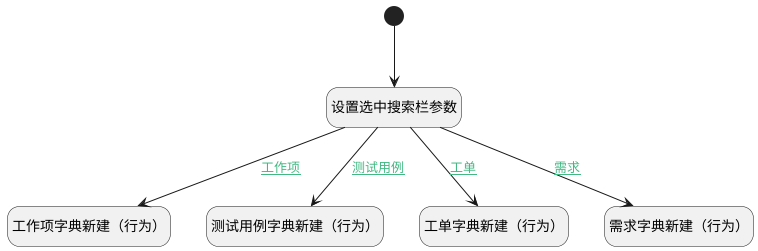

## 获取搜索栏参数 <!-- {docsify-ignore-all} -->

   

### 处理过程




### 处理步骤说明

#### 开始 :id=Begin<sup class="footnote-symbol"> <font color=gray size=1>[开始]</font></sup>


#### 需求字典新建（行为） :id=DEUIACTION1<sup class="footnote-symbol"> <font color=gray size=1>[实体界面行为调用]</font></sup>


调用实体 [数据字典(DICTIONARY)](module/Base/dictionary_data.md) 界面行为 [需求字典新建（行为）](module/Base/dictionary_data#界面行为) ，行为参数为`Default(传入变量)`

#### 设置选中搜索栏参数 :id=RAWJSCODE1<sup class="footnote-symbol"> <font color=gray size=1>[直接前台代码]</font></sup>


<p class="panel-title"><b>执行代码</b></p>

```javascript
var tabsearchbar = uiLogic.tabsearchbar;
var catalog = tabsearchbar.state.selectedGroupItem.id
var type = ""

if (catalog == "work_item_pro") {
    catalog = "work_item_probability";
}
uiLogic.default.catalog = catalog;

if (catalog.includes("idea")) {
    type = "idea"
} else if (catalog.includes("ticket")) {
    type = "ticket"
} else if (catalog.includes("work_item")) {
    type = "work_item"
} else if (catalog.includes("test_case")) {
    type = "test_case"
}
uiLogic.default.type = type;

```

#### 工单字典新建（行为） :id=DEUIACTION2<sup class="footnote-symbol"> <font color=gray size=1>[实体界面行为调用]</font></sup>


调用实体 [数据字典(DICTIONARY)](module/Base/dictionary_data.md) 界面行为 [工单字典新建（行为）](module/Base/dictionary_data#界面行为) ，行为参数为`Default(传入变量)`

#### 工作项字典新建（行为） :id=DEUIACTION3<sup class="footnote-symbol"> <font color=gray size=1>[实体界面行为调用]</font></sup>


调用实体 [数据字典(DICTIONARY)](module/Base/dictionary_data.md) 界面行为 [工作项字典新建（行为）](module/Base/dictionary_data#界面行为) ，行为参数为`Default(传入变量)`

#### 测试用例字典新建（行为） :id=DEUIACTION4<sup class="footnote-symbol"> <font color=gray size=1>[实体界面行为调用]</font></sup>


调用实体 [数据字典(DICTIONARY)](module/Base/dictionary_data.md) 界面行为 [测试用例字典新建（行为）](module/Base/dictionary_data#界面行为) ，行为参数为`Default(传入变量)`

### 连接条件说明
#### 需求 :id=RAWJSCODE1-DEUIACTION1

```Default(传入变量).type``` EQ ```idea```
#### 工单 :id=RAWJSCODE1-DEUIACTION2

```Default(传入变量).type``` EQ ```ticket```
#### 工作项 :id=RAWJSCODE1-DEUIACTION3

```Default(传入变量).type``` EQ ```work_item```
#### 测试用例 :id=RAWJSCODE1-DEUIACTION4

```Default(传入变量).type``` EQ ```test_case```


### 实体逻辑参数

|    中文名   |    代码名    |  数据类型      |备注 |
| --------| --------| --------  | --------   |
|传入变量(<i class="fa fa-check"/></i>)|Default|数据对象||
|tabsearchbar|tabsearchbar|部件对象||
