## 获取其他仪表盘 <!-- {docsify-ignore-all} -->

   获取其他仪表盘

### 处理过程

```plantuml
@startuml
hide empty description
<style>
root {
  HyperlinkColor #42b983
}
</style>

hide empty description
state "开始" as Begin <<start>> [[$./fill_other_board#begin {"开始"}]]
state "结束" as END1 <<end>> [[$./fill_other_board#end1 {"结束"}]]
state "调试逻辑参数" as DEBUGPARAM1  [[$./fill_other_board#debugparam1 {"调试逻辑参数"}]]
state "准备参数" as PREPAREPARAM1  [[$./fill_other_board#prepareparam1 {"准备参数"}]]
state "实体数据集" as DEDATASET1  [[$./fill_other_board#dedataset1 {"实体数据集"}]]
state "准备参数" as PREPAREPARAM2  [[$./fill_other_board#prepareparam2 {"准备参数"}]]


Begin --> DEBUGPARAM1
DEBUGPARAM1 --> PREPAREPARAM1
PREPAREPARAM1 --> DEDATASET1
DEDATASET1 --> PREPAREPARAM2
PREPAREPARAM2 --> END1


@enduml
```

### 处理步骤说明

#### 开始 :id=Begin [开始]

*- N/A*
#### 结束 :id=END1 [结束]

返回 `board_info(报表信息)`

#### 调试逻辑参数 :id=DEBUGPARAM1 [调试逻辑参数]

> [!NOTE|label:调试信息|icon:fa fa-bug]
> 调试输出参数`Default(传入变量)`的详细信息

#### 准备参数 :id=PREPAREPARAM1 [准备参数]

1. 将`Default(传入变量).OWNER_ID(所属数据标识)` 设置给  `filter(过滤器).n_owner_id_eq`

#### 实体数据集 :id=DEDATASET1 [实体数据集]

调用实体 [动态数据看板(DYNADASHBOARD)](module/Base/dyna_dashboard.md) 数据集合 [正常数据(normal)](module/Base/dyna_dashboard#数据集合) ，查询参数为`filter(过滤器)`

将执行结果返回给参数`board_page(报表分页结果)`

#### 准备参数 :id=PREPAREPARAM2 [准备参数]

1. 将`board_page(报表分页结果).0` 绑定给  `board_info(报表信息)`

### 实体逻辑参数

|    中文名   |    代码名    |  数据类型    |  实体   |备注 |
| --------| --------| -------- | -------- | --------   |
|传入变量(<i class="fa fa-check"/></i>)|Default|数据对象|[动态数据看板(DYNADASHBOARD)](module/Base/dyna_dashboard.md)||
|报表信息|board_info|数据对象|[动态数据看板(DYNADASHBOARD)](module/Base/dyna_dashboard.md)||
|报表分页结果|board_page|分页查询|||
|过滤器|filter|过滤器|||
