## 仅获取 <!-- {docsify-ignore-all} -->

   

### 处理过程

```plantuml
@startuml
hide empty description
<style>
root {
  HyperlinkColor #42b983
}
</style>

hide empty description
state "开始" as Begin <<start>> [[$./only_get#begin {"开始"}]]
state "结束" as END1 <<end>> [[$./only_get#end1 {"结束"}]]
state "调试逻辑参数" as DEBUGPARAM1  [[$./only_get#debugparam1 {"调试逻辑参数"}]]
state "直接SQL调用" as RAWSQLCALL1  [[$./only_get#rawsqlcall1 {"直接SQL调用"}]]


Begin --> DEBUGPARAM1
DEBUGPARAM1 --> RAWSQLCALL1
RAWSQLCALL1 --> END1


@enduml
```




### 处理步骤说明

#### 开始 :id=Begin<sup class="footnote-symbol"> <font color=gray size=1>[开始]</font></sup>


*- N/A*
#### 结束 :id=END1<sup class="footnote-symbol"> <font color=gray size=1>[结束]</font></sup>


返回 `Default(传入变量)`

#### 调试逻辑参数 :id=DEBUGPARAM1<sup class="footnote-symbol"> <font color=gray size=1>[调试逻辑参数]</font></sup>


> [!NOTE|label:调试信息|icon:fa fa-bug]
> 调试输出参数`Default(传入变量)`的详细信息


#### 直接SQL调用 :id=RAWSQLCALL1<sup class="footnote-symbol"> <font color=gray size=1>[直接SQL调用]</font></sup>


<p class="panel-title"><b>执行sql语句</b></p>

```sql
SELECT
t1.`APPID`,
t1.`CREATEDATE`,
t1.`CREATEMAN`,
t1.`DYNADASHBOARDID`,
t1.`DYNADASHBOARDNAME`,
t1.`EXAMPLE_CHART`,
t1.`IS_SYSTEM`,
t1.`MODELID`,
t1.`OWNER_ID`,
t1.`OWNER_TYPE`,
t1.`SEQUENCES`,
t1.`TYPE`,
t1.`UPDATE_MAN`,
t1.`UPDATE_TIME`,
t1.`USERID`
FROM `DYNADASHBOARD` t1 
WHERE t1.DYNADASHBOARDID = ?

```

<p class="panel-title"><b>执行sql参数</b></p>

1. `Default(传入变量).DYNADASHBOARDID(动态数据看板标识)`

重置参数`Default(传入变量)`，并将执行sql结果赋值给参数`Default(传入变量)`


### 实体逻辑参数

|    中文名   |    代码名    |  数据类型    |  实体   |备注 |
| --------| --------| -------- | -------- | --------   |
|传入变量(<i class="fa fa-check"/></i>)|Default|数据对象|[动态数据看板(DYNADASHBOARD)](module/Base/dyna_dashboard.md)||
