## 更新看板部件模型 <!-- {docsify-ignore-all} -->

   

### 处理过程

```plantuml
@startuml
hide empty description
<style>
root {
  HyperlinkColor #42b983
}
</style>

hide empty description
state "开始" as Begin <<start>> [[$./sync_portlet_model#begin {"开始"}]]
state "结束" as END1 <<end>> [[$./sync_portlet_model#end1 {"结束"}]]
state "更新看板部件模型" as RAWSFCODE1  [[$./sync_portlet_model#rawsfcode1 {"更新看板部件模型"}]]


Begin --> RAWSFCODE1
RAWSFCODE1 --> END1


@enduml
```




### 处理步骤说明

#### 开始 :id=Begin<sup class="footnote-symbol"> <font color=gray size=1>[开始]</font></sup>


*- N/A*
#### 结束 :id=END1<sup class="footnote-symbol"> <font color=gray size=1>[结束]</font></sup>


*- N/A*

#### 更新看板部件模型 :id=RAWSFCODE1<sup class="footnote-symbol"> <font color=gray size=1>[直接后台代码]</font></sup>


<p class="panel-title"><b>执行代码[JavaScript]</b></p>

```javascript
var _default = logic.getParam("default");
var strModel = _default.get("model");
var modeljO = JSON.parse(strModel);
var modeljArray = modeljO.model;
var biPortletIds = [];
var replaceIds ={};
var biPortletDigest ={};
for(var i=0; i<modeljArray.length; i++){
  var reportModel = modeljArray[i];
  var dynamodelFlag =  reportModel.dynamodelFlag;
  if(dynamodelFlag && dynamodelFlag == 1){
    var portletId =  reportModel.portletId;
    var portletDigest = reportModel.controlmodeldigest?reportModel.controlmodeldigest:"__needRefresh__";
    biPortletIds.push(portletId);
    biPortletDigest[portletId] = portletDigest;
  }
}
var portletSearchContext = sys.filter("psappportlet");
var viewPortlets = portletSearchContext.in("psappportletid",biPortletIds.join(",")).eq("pssysappid","plmweb").ne("dynamodelflag",0).pageable(0,200).select();
for(var i=0; i<viewPortlets.length; i++){
    var biPortlet = viewPortlets.get(i);
    var biPortletId = biPortlet.get("psappportletid");
    var curPortletDigest = biPortlet.get("controlmodeldigest");
    if(biPortletDigest[biPortletId] && biPortletDigest[biPortletId] != curPortletDigest){
        var  lastBIPortlet = biPortlet.last();
        replaceIds[biPortletId] = lastBIPortlet;
    }
}
for(var j=0; j<modeljArray.length; j++){
  var dynamodelFlag =  reportModel.dynamodelFlag;    
  if(dynamodelFlag != 1){
      continue;
  }
  var reportModel2 = modeljArray[j];
  var portletId2 = reportModel2.portletId;
  reportModel2["orignModel"] = false;

  if(replaceIds[portletId2] != null){
        reportModel2.portletModel = JSON.parse(replaceIds[portletId2].get("controlmodel"))
        reportModel2["orignModel"] = true;
        reportModel2["controlmodeldigest"] = replaceIds[portletId2].get("controlmodeldigest");
  }
  if(reportModel2.portletModel.controlmodeldigest){
        reportModel2["orignModel"] = true;
  }
}
_default.set("model",JSON.stringify(modeljO));
```


### 实体逻辑参数

|    中文名   |    代码名    |  数据类型    |  实体   |备注 |
| --------| --------| -------- | -------- | --------   |
|传入变量(<i class="fa fa-check"/></i>)|Default|数据对象|[动态数据看板(DYNADASHBOARD)](module/Base/dyna_dashboard.md)||
