## 使用此模板 <!-- {docsify-ignore-all} -->

   使用此模板

### 处理过程

```plantuml
@startuml
hide empty description
<style>
root {
  HyperlinkColor #42b983
}
</style>

hide empty description
state "开始" as Begin <<start>> [[$./use_cur_template#begin {"开始"}]]
state "查询当前视图下的看板" as DEDATASET1  [[$./use_cur_template#dedataset1 {"查询当前视图下的看板"}]]
state "获取选中看板ID" as PREPAREPARAM1  [[$./use_cur_template#prepareparam1 {"获取选中看板ID"}]]
state "获取选中看板数据" as DEACTION1  [[$./use_cur_template#deaction1 {"获取选中看板数据"}]]
state "准备参数" as PREPAREPARAM2  [[$./use_cur_template#prepareparam2 {"准备参数"}]]
state "结束" as END1 <<end>> [[$./use_cur_template#end1 {"结束"}]]
state "调试逻辑参数" as DEBUGPARAM1  [[$./use_cur_template#debugparam1 {"调试逻辑参数"}]]
state "设置过滤参数" as PREPAREPARAM3  [[$./use_cur_template#prepareparam3 {"设置过滤参数"}]]
state "用户自定义名称" as PREPAREPARAM5  [[$./use_cur_template#prepareparam5 {"用户自定义名称"}]]
state "调试逻辑参数" as DEBUGPARAM2  [[$./use_cur_template#debugparam2 {"调试逻辑参数"}]]
state "准备参数" as PREPAREPARAM4  [[$./use_cur_template#prepareparam4 {"准备参数"}]]
state "生成报表" as RAWSFCODE1  [[$./use_cur_template#rawsfcode1 {"生成报表"}]]
state "创建看板" as DEACTION2  [[$./use_cur_template#deaction2 {"创建看板"}]]


Begin --> DEBUGPARAM1
DEBUGPARAM1 --> PREPAREPARAM3
PREPAREPARAM3 --> DEDATASET1
DEDATASET1 --> DEBUGPARAM2 : [[$./use_cur_template#dedataset1-debugparam2{第一条} 第一条]]
DEBUGPARAM2 --> PREPAREPARAM4
PREPAREPARAM4 --> PREPAREPARAM1
PREPAREPARAM1 --> DEACTION1
DEACTION1 --> PREPAREPARAM5
PREPAREPARAM5 --> PREPAREPARAM2
PREPAREPARAM2 --> RAWSFCODE1
RAWSFCODE1 --> DEACTION2
DEACTION2 --> END1
DEDATASET1 --> PREPAREPARAM1 : [[$./use_cur_template#dedataset1-prepareparam1{非第一条} 非第一条]]


@enduml
```




### 处理步骤说明

#### 开始 :id=Begin<sup class="footnote-symbol"> <font color=gray size=1>[开始]</font></sup>


*- N/A*
#### 查询当前视图下的看板 :id=DEDATASET1<sup class="footnote-symbol"> <font color=gray size=1>[实体数据集]</font></sup>


调用实体 [动态数据看板(DYNADASHBOARD)](module/Base/dyna_dashboard.md) 数据集合 [数据集(DEFAULT)](module/Base/dyna_dashboard#数据集合) ，查询参数为`board_filter(仪表盘过滤器)`

将执行结果返回给参数`board_page(仪表盘分页查询结果)`

#### 获取选中看板ID :id=PREPAREPARAM1<sup class="footnote-symbol"> <font color=gray size=1>[准备参数]</font></sup>


1. 将`Default(传入变量).dyna_dashboard_id` 设置给  `dynadashboard(仪表盘).DYNADASHBOARDID(动态数据看板标识)`

#### 获取选中看板数据 :id=DEACTION1<sup class="footnote-symbol"> <font color=gray size=1>[实体行为]</font></sup>


调用实体 [动态数据看板(DYNADASHBOARD)](module/Base/dyna_dashboard.md) 行为 [Get](module/Base/dyna_dashboard#行为) ，行为参数为`dynadashboard(仪表盘)`

#### 准备参数 :id=PREPAREPARAM2<sup class="footnote-symbol"> <font color=gray size=1>[准备参数]</font></sup>


1. 将`dynadashboard(仪表盘).DYNADASHBOARDNAME(名称)` 设置给  `new_board(新仪表盘).DYNADASHBOARDNAME(名称)`
2. 将`dynadashboard(仪表盘).MODELID(模型标识)` 设置给  `new_board(新仪表盘).MODELID(模型标识)`
3. 将`insight_view` 设置给  `new_board(新仪表盘).OWNER_TYPE(所属数据类型)`
4. 将`data` 设置给  `new_board(新仪表盘).TYPE(看板类型)`
5. 将`dynadashboard(仪表盘).MODEL(模型)` 设置给  `new_board(新仪表盘).MODEL(模型)`
6. 将`dynadashboard(仪表盘).APPID(应用标识)` 设置给  `new_board(新仪表盘).APPID(应用标识)`
7. 将`Default(传入变量).owner_id(所属数据标识)` 设置给  `new_board(新仪表盘).OWNER_ID(所属数据标识)`

#### 结束 :id=END1<sup class="footnote-symbol"> <font color=gray size=1>[结束]</font></sup>


返回 `new_board(新仪表盘)`

#### 调试逻辑参数 :id=DEBUGPARAM1<sup class="footnote-symbol"> <font color=gray size=1>[调试逻辑参数]</font></sup>


> [!NOTE|label:调试信息|icon:fa fa-bug]
> 调试输出参数`Default(传入变量)`的详细信息


#### 设置过滤参数 :id=PREPAREPARAM3<sup class="footnote-symbol"> <font color=gray size=1>[准备参数]</font></sup>


1. 将`Default(传入变量).owner_id(所属数据标识)` 设置给  `board_filter(仪表盘过滤器).N_OWNER_ID_EQ`

#### 用户自定义名称 :id=PREPAREPARAM5<sup class="footnote-symbol"> <font color=gray size=1>[准备参数]</font></sup>


1. 将`Default(传入变量).board_name` 设置给  `dynadashboard(仪表盘).DYNADASHBOARDNAME(名称)`

#### 调试逻辑参数 :id=DEBUGPARAM2<sup class="footnote-symbol"> <font color=gray size=1>[调试逻辑参数]</font></sup>


> [!NOTE|label:调试信息|icon:fa fa-bug]
> 调试输出参数`board_page(仪表盘分页查询结果)`的详细信息


#### 准备参数 :id=PREPAREPARAM4<sup class="footnote-symbol"> <font color=gray size=1>[准备参数]</font></sup>


1. 将`Default(传入变量).owner_id(所属数据标识)` 设置给  `new_board(新仪表盘).DYNADASHBOARDID(动态数据看板标识)`

#### 生成报表 :id=RAWSFCODE1<sup class="footnote-symbol"> <font color=gray size=1>[直接后台代码]</font></sup>


<p class="panel-title"><b>执行代码[JavaScript]</b></p>

```javascript
var new_board = logic.getParam("new_board");
var strModel = new_board.get("model");
var modeljO = JSON.parse(strModel);
var modeljArray = modeljO.model;
var bireportids = [];
var replaceIds ={};
for(var i=0; i<modeljArray.length; i++){
    sys.info("进入第一个循环")
  var reportModel = modeljArray[i];
  var portletid = reportModel.i;
  var bireportid = portletid.substring(12).replace("__",".");
  bireportids.push(bireportid);
}
var reportSearchContext = sys.filter("insight_report");
var templReports = reportSearchContext.in("id",bireportids.join(",")).pageable(0,1000).select("is_system");
for(var i=0; i<templReports.length; i++){
    sys.info("进入第二个循环")
    var bireport = templReports.get(i);
    var orginId = bireport.get("id");
    bireport.reset("id");
    bireport.set("view_id",new_board.get("owner_id"));
    bireport.set("is_system",0);
    var newbireport = bireport.create();
    replaceIds[orginId.replace(".","__").toLowerCase()] = newbireport.get("id").replace(".","__").toLowerCase();
}
for(var key in replaceIds){
    sys.info("进入第三个循环")
    var keyreg = new RegExp(key, "g");
    strModel = strModel.replace(keyreg,replaceIds[key]);
}
new_board.set("model",strModel);
```

#### 创建看板 :id=DEACTION2<sup class="footnote-symbol"> <font color=gray size=1>[实体行为]</font></sup>


调用实体 [动态数据看板(DYNADASHBOARD)](module/Base/dyna_dashboard.md) 行为 [Create](module/Base/dyna_dashboard#行为) ，行为参数为`new_board(新仪表盘)`

将执行结果返回给参数`new_board(新仪表盘)`


### 连接条件说明
#### 第一条 :id=DEDATASET1-DEBUGPARAM2

`board_page(仪表盘分页查询结果).size` EQ `0`
#### 非第一条 :id=DEDATASET1-PREPAREPARAM1

`board_page(仪表盘分页查询结果).size` NOTEQ `0`


### 实体逻辑参数

|    中文名   |    代码名    |  数据类型    |  实体   |备注 |
| --------| --------| -------- | -------- | --------   |
|传入变量(<i class="fa fa-check"/></i>)|Default|数据对象|[动态数据看板(DYNADASHBOARD)](module/Base/dyna_dashboard.md)||
|仪表盘过滤器|board_filter|过滤器|||
|仪表盘分页查询结果|board_page|分页查询|||
|仪表盘|dynadashboard|数据对象|[动态数据看板(DYNADASHBOARD)](module/Base/dyna_dashboard.md)||
|新仪表盘|new_board|数据对象|[动态数据看板(DYNADASHBOARD)](module/Base/dyna_dashboard.md)||
