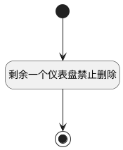

## 仪表盘操作列 <!-- {docsify-ignore-all} -->

   仪表盘为最后一个时禁止删除

### 处理过程




### 处理步骤说明

#### 开始 :id=Begin<sup class="footnote-symbol"> <font color=gray size=1>[开始]</font></sup>


#### 剩余一个仪表盘禁止删除 :id=RAWJSCODE1<sup class="footnote-symbol"> <font color=gray size=1>[直接前台代码]</font></sup>


<p class="panel-title"><b>执行代码</b></p>

```javascript
  const rows = uiLogic.grid.state.rows;
//   console.log(rows);
  if (rows && rows.length === 1) {
    rows.forEach(row => {
        row.uaColStates.uagridcolumn1.u36f5de4.disabled = true
    })
  }
```

#### 结束 :id=END1<sup class="footnote-symbol"> <font color=gray size=1>[结束]</font></sup>


### 实体逻辑参数

|    中文名   |    代码名    |  数据类型      |备注 |
| --------| --------| --------  | --------   |
|传入变量(<i class="fa fa-check"/></i>)|Default|数据对象||
|表格|grid|当前部件对象||
