## 获取其他仪表盘 <!-- {docsify-ignore-all} -->

   获取其他仪表盘

### 处理过程

```plantuml
@startuml
hide footbox
<style>
root {
  HyperlinkColor #42b983
}
</style>

hide empty description
state "开始" as Begin <<start>> [[$./fill_other_board#begin {开始}]]
state "调试逻辑参数" as DEBUGPARAM1  [[$./fill_other_board#debugparam1 {调试逻辑参数}]]
state "准备参数" as PREPAREJSPARAM1  [[$./fill_other_board#preparejsparam1 {准备参数}]]
state "结束" as END1 <<end>> [[$./fill_other_board#end1 {结束}]]
state "准备参数" as PREPAREJSPARAM2  [[$./fill_other_board#preparejsparam2 {准备参数}]]
state "界面行为" as DEUIACTION1  [[$./fill_other_board#deuiaction1 {界面行为}]]
state "实体行为" as DEACTION1  [[$./fill_other_board#deaction1 {实体行为}]]


Begin --> PREPAREJSPARAM1
PREPAREJSPARAM1 --> DEACTION1
DEACTION1 --> DEBUGPARAM1
DEBUGPARAM1 --> PREPAREJSPARAM2
PREPAREJSPARAM2 --> DEUIACTION1
DEUIACTION1 --> END1


@enduml
```

### 处理步骤说明

#### 开始 :id=Begin [开始]

#### 结束 :id=END1 [结束]

#### 准备参数 :id=PREPAREJSPARAM1 [准备参数]

1. 将`ctx(上下文).insight_view` 设置给  `board_info(报表信息).insight_view`

#### 实体行为 :id=DEACTION1 [实体行为]

调用实体 [动态数据看板(DYNADASHBOARD)](module/Base/dyna_dashboard.md) 行为 [获取其他仪表盘(fill_other_board)](module/Base/dyna_dashboard#行为) ，行为参数为`board_info(报表信息)`

将执行结果返回给参数`board_info(报表信息)`

#### 调试逻辑参数 :id=DEBUGPARAM1 [调试逻辑参数]

> [!NOTE|label:调试信息|icon:fa fa-bug]
> 调试输出参数`报表信息`的详细信息

#### 准备参数 :id=PREPAREJSPARAM2 [准备参数]

1. 将`board_info(报表信息).dyna_dashboard_id` 设置给  `ctx(上下文).dyna_dashboard`
2. 将`board_info(报表信息).dyna_dashboard_id` 设置给  `board_info(报表信息).DynaDashboardId`
3. 将`board_info(报表信息).dyna_dashboard_id` 设置给  `board_info(报表信息).srfdynadashboardid`

#### 界面行为 :id=DEUIACTION1 [实体界面行为调用]

调用实体 [动态数据看板(DYNADASHBOARD)](module/Base/dyna_dashboard.md) 界面行为 [打开新建看板](module/Base/dyna_dashboard#界面行为) ，行为参数为`board_info(报表信息)`

### 实体逻辑参数

|    中文名   |    代码名    |  数据类型      |备注 |
| --------| --------| --------  | --------   |
|报表信息|board_info|数据对象||
|上下文|ctx|导航视图参数绑定参数||
|传入变量(<i class="fa fa-check"/></i>)|Default|数据对象||
|当前视图|view|当前视图对象||
