## 列表加载完成 <!-- {docsify-ignore-all} -->

   

### 处理过程

```plantuml
@startuml
hide footbox
<style>
root {
  HyperlinkColor #42b983
}
</style>

hide empty description
state "开始" as Begin <<start>> [[$./list_load_success#begin {开始}]]
state "设置默认仪盘表标题" as RAWJSCODE1  [[$./list_load_success#rawjscode1 {设置默认仪盘表标题}]]


Begin --> RAWJSCODE1


@enduml
```




### 处理步骤说明

#### 开始 :id=Begin<sup class="footnote-symbol"> <font color=gray size=1>[开始]</font></sup>


#### 设置默认仪盘表标题 :id=RAWJSCODE1<sup class="footnote-symbol"> <font color=gray size=1>[直接前台代码]</font></sup>


<p class="panel-title"><b>执行代码</b></p>

```javascript
const selectData = uiLogic.ctrl.state.selectedData;
if(selectData != null &&  selectData.length > 0){
    const firstObject = selectData[0];
    if(firstObject.dyna_dashboard_name != null && firstObject.dyna_dashboard_name != undefined){
        view.layoutPanel.panelItems.board_title.setDataValue(firstObject.dyna_dashboard_name);
    }  
}
```


### 实体逻辑参数

|    中文名   |    代码名    |  数据类型      |备注 |
| --------| --------| --------  | --------   |
|传入变量(<i class="fa fa-check"/></i>)|Default|数据对象||
|当前部件对象|ctrl|当前部件对象||
