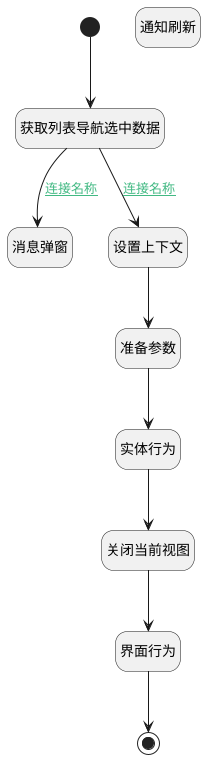

## 使用此模板 <!-- {docsify-ignore-all} -->

   

### 处理过程




### 处理步骤说明

#### 通知刷新 :id=RAWJSCODE3<sup class="footnote-symbol"> <font color=gray size=1>[直接前台代码]</font></sup>


<p class="panel-title"><b>执行代码</b></p>

```javascript
ibiz.mc.command.update.send({ srfdecodename: 'insight_view', srfkey: context.insight_view})
```

#### 开始 :id=Begin<sup class="footnote-symbol"> <font color=gray size=1>[开始]</font></sup>


#### 结束 :id=END1<sup class="footnote-symbol"> <font color=gray size=1>[结束]</font></sup>


#### 获取列表导航选中数据 :id=PREPAREJSPARAM1<sup class="footnote-symbol"> <font color=gray size=1>[准备参数]</font></sup>


1. 将`listexpbar(列表对象).xDataController.state.selectedData` 绑定给  `selecteddata(选中数据)`

#### 设置上下文 :id=RAWJSCODE1<sup class="footnote-symbol"> <font color=gray size=1>[直接前台代码]</font></sup>


<p class="panel-title"><b>执行代码</b></p>

```javascript
if(uiLogic.selecteddata && uiLogic.selecteddata.length >0){
    uiLogic.ctx.dynadashboard = uiLogic.selecteddata[0].dynadashboardid;
    uiLogic.dyna_dashboard_info = uiLogic.selecteddata[0];
    uiLogic.dyna_dashboard_info.owner_id = uiLogic.ctx.insight_view_id;
}
```

#### 准备参数 :id=PREPAREJSPARAM2<sup class="footnote-symbol"> <font color=gray size=1>[准备参数]</font></sup>


1. 将`Default(传入变量).board_name` 设置给  `dyna_dashboard_info(看板数据).board_name`

#### 实体行为 :id=DEACTION1<sup class="footnote-symbol"> <font color=gray size=1>[实体行为]</font></sup>


调用实体 [动态数据看板(DYNADASHBOARD)](module/Base/dyna_dashboard.md) 行为 [使用此模板(use_cur_template)](module/Base/dyna_dashboard#行为) ，行为参数为`dyna_dashboard_info(看板数据)`

将执行结果返回给参数`new_dynadashboard(新仪表盘)`

#### 关闭当前视图 :id=RAWJSCODE2<sup class="footnote-symbol"> <font color=gray size=1>[直接前台代码]</font></sup>


<p class="panel-title"><b>执行代码</b></p>

```javascript
view.state.isLoading = false;
view.closeView();
```

#### 界面行为 :id=DEUIACTION1<sup class="footnote-symbol"> <font color=gray size=1>[实体界面行为调用]</font></sup>


调用实体 [动态数据看板(DYNADASHBOARD)](module/Base/dyna_dashboard.md) 界面行为 [打开新建看板](module/Base/dyna_dashboard#界面行为) ，行为参数为`new_dynadashboard(新仪表盘)`

#### 消息弹窗 :id=MSGBOX1<sup class="footnote-symbol"> <font color=gray size=1>[消息弹窗]</font></sup>


### 连接条件说明
#### 连接名称 :id=PREPAREJSPARAM1-RAWJSCODE1

```Default(传入变量).board_name``` ISNOTNULL
#### 连接名称 :id=PREPAREJSPARAM1-MSGBOX1

```Default(传入变量).board_name``` ISNULL


### 实体逻辑参数

|    中文名   |    代码名    |  数据类型      |备注 |
| --------| --------| --------  | --------   |
|列表对象|listexpbar|部件对象||
|当前视图对象|view|当前视图对象||
|新仪表盘|new_dynadashboard|数据对象||
|传入变量(<i class="fa fa-check"/></i>)|Default|数据对象||
|看板数据|dyna_dashboard_info|数据对象||
|上下文|ctx|导航视图参数绑定参数||
|选中数据|selecteddata|数据对象列表||
