## 添加执行人时发送通知 <!-- {docsify-ignore-all} -->

   添加执行人时发送通知

### 处理过程

```plantuml
@startuml
hide empty description
<style>
root {
  HyperlinkColor #42b983
}
</style>

hide empty description
state "开始" as Begin <<start>> [[$./after_create_notice#begin {"开始"}]]
state "通知工作项执行人" as DENOTIFY1  [[$./after_create_notice#denotify1 {"通知工作项执行人"}]]
state "结束" as END1 <<end>> [[$./after_create_notice#end1 {"结束"}]]


Begin --> DENOTIFY1 : [[$./after_create_notice#begin-denotify1{工作项} 工作项]]
DENOTIFY1 --> END1


@enduml
```

### 处理步骤说明

#### 开始 :id=Begin [开始]

*- N/A*
#### 通知工作项执行人 :id=DENOTIFY1 [实体通知]

调用实体 [执行人(EXECUTOR)](module/Base/executor.md) 通知 [通知工作项执行人(work_item_executor)](module/Base/executor/notify/work_item_executor) ，参数为`Default(传入变量)`
#### 结束 :id=END1 [结束]

*- N/A*

### 连接条件说明
#### 工作项 :id=Begin-DENOTIFY1

 AND `Default(传入变量).OWNER_TYPE(所属数据对象)` EQ `WORK_ITEM`

### 实体逻辑参数

|    中文名   |    代码名    |  数据类型    |  实体   |备注 |
| --------| --------| -------- | -------- | --------   |
|传入变量(<i class="fa fa-check"/></i>)|Default|数据对象|[执行人(EXECUTOR)](module/Base/executor.md)||
