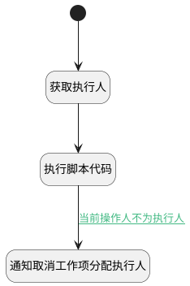

## 删除执行人时发送通知 <!-- {docsify-ignore-all} -->

   删除执行人时发送通知

### 处理过程




### 处理步骤说明

#### 开始 :id=Begin<sup class="footnote-symbol"> <font color=gray size=1>[开始]</font></sup>


*- N/A*
#### 获取执行人 :id=DEACTION1<sup class="footnote-symbol"> <font color=gray size=1>[实体行为]</font></sup>


调用实体 [执行人(EXECUTOR)](module/Base/executor.md) 行为 [Get](module/Base/executor#行为) ，行为参数为`Default(传入变量)`

将执行结果返回给参数`Default(传入变量)`

#### 执行脚本代码 :id=RAWSFCODE1<sup class="footnote-symbol"> <font color=gray size=1>[直接后台代码]</font></sup>


<p class="panel-title"><b>执行代码[Groovy]</b></p>

```groovy
//获取当前用户
def user = sys.user()
def _default = logic.param('Default').getReal()
if(_default.get('user_id') == user.getUserid()){
    _default.set('is_current_user', '1')
}
```

#### 通知取消工作项分配执行人 :id=DENOTIFY1<sup class="footnote-symbol"> <font color=gray size=1>[实体通知]</font></sup>


调用实体 [执行人(EXECUTOR)](module/Base/executor.md) 通知 [通知取消工作项分配执行人(cancel_work_item_executor)](module/Base/executor/notify/cancel_work_item_executor) ，参数为`Default(传入变量)`

### 连接条件说明
#### 当前操作人不为执行人 :id=RAWSFCODE1-DENOTIFY1

`Default(传入变量).is_current_user` ISNULL


### 实体逻辑参数

|    中文名   |    代码名    |  数据类型    |  实体   |备注 |
| --------| --------| -------- | -------- | --------   |
|传入变量(<i class="fa fa-check"/></i>)|Default|数据对象|[执行人(EXECUTOR)](module/Base/executor.md)||
