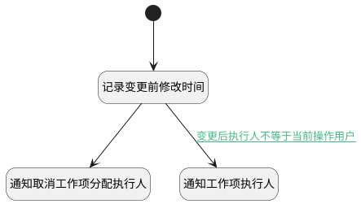

## 执行人变更附加逻辑 <!-- {docsify-ignore-all} -->

   执行人变更附加逻辑

### 处理过程

### 处理步骤说明

#### 开始 :id=Begin [开始]

*- N/A*
#### 记录变更前修改时间 :id=PREPAREPARAM1 [准备参数]

1. 将`Default(传入变量).UPDATE_MAN(更新人)` 设置给  `Last(变更前对象).UPDATE_MAN(更新人)`
2. 将`Default(传入变量).UPDATE_TIME(更新时间)` 设置给  `Last(变更前对象).UPDATE_TIME(更新时间)`

#### 通知取消工作项分配执行人 :id=DENOTIFY1 [实体通知]

调用实体 [执行人(EXECUTOR)](module/Base/executor.md) 通知 [工作项取消执行人通知(cancel_work_item_executor)](module/Base/executor/notify/cancel_work_item_executor) ，参数为`Last(变更前对象)`
#### 通知工作项执行人 :id=DENOTIFY2 [实体通知]

调用实体 [执行人(EXECUTOR)](module/Base/executor.md) 通知 [工作项分配执行人通知(work_item_executor)](module/Base/executor/notify/work_item_executor) ，参数为`Default(传入变量)`

### 连接条件说明
#### 变更前执行人不等于当前操作用户 

#### 变更后执行人不等于当前操作用户 :id=PREPAREPARAM1-DENOTIFY2

`Default(传入变量).USER_ID(执行人标识)` ISNOTNULL AND 

### 实体逻辑参数

|    中文名   |    代码名    |  数据类型    |  实体   |备注 |
| --------| --------| -------- | -------- | --------   |
|传入变量(<i class="fa fa-check"/></i>)|Default|数据对象|[执行人(EXECUTOR)](module/Base/executor.md)||
|变更前对象|Last|最后数据变量|||
