## 重载动态打印模版 <!-- {docsify-ignore-all} -->

   重载动态打印模版

### 处理过程

```plantuml
@startuml
hide empty description
<style>
root {
  HyperlinkColor #42b983
}
</style>

hide empty description
state "开始" as Begin <<start>> [[$./reload_print_temp#begin {"开始"}]]
state "触发刷新信号" as RAWSFCODE_01  [[$./reload_print_temp#rawsfcode_01 {"触发刷新信号"}]]


Begin --> RAWSFCODE_01


@enduml
```




### 处理步骤说明

#### 开始 :id=Begin<sup class="footnote-symbol"> <font color=gray size=1>[开始]</font></sup>


*- N/A*
#### 触发刷新信号 :id=RAWSFCODE_01<sup class="footnote-symbol"> <font color=gray size=1>[直接后台代码]</font></sup>


<p class="panel-title"><b>执行代码[Groovy]</b></p>

```groovy
def _default = logic.param('Default').getReal()
def de_tag = _default.get("de_tag")
if (de_tag != null){
    def de_runtime = sys.dataentity(de_tag)
    def fullUniqueTag = de_runtime.getFullUniqueTag().replace(".", "-").toLowerCase()
    def system_id = sys.deploySystemId
    //合成当前系统AI工厂reload信号标识
    def reload_signal_prefix = "reloadsignal"
    def reload_signal_id = "${reload_signal_prefix}-${system_id}-deprint-${fullUniqueTag}-dynamic_chat_resource"
    println "发布动态聊天资源配置:${reload_signal_id}"
    def config = [:]
    config.reload_time = net.ibizsys.runtime.util.DateUtils.getCurTimeString()
    //发布配置
    net.ibizsys.central.cloud.core.spring.rt.ServiceHub.getInstance().publishConfig(reload_signal_id, config)
}


```


### 实体逻辑参数

|    中文名   |    代码名    |  数据类型    |  实体   |备注 |
| --------| --------| -------- | -------- | --------   |
|传入变量(<i class="fa fa-check"/></i>)|Default|数据对象|[扩展打印模板(EXTEND_PRINT_TEMPL)](module/Base/extend_print_templ.md)||
