## 文档解析记录 <!-- {docsify-ignore-all} -->

   

### 处理过程

```plantuml
@startuml
hide empty description
<style>
root {
  HyperlinkColor #42b983
}
</style>

hide empty description
state "开始" as Begin <<start>> [[$./doc_parse_record#begin {"开始"}]]
state "准备参数" as PREPAREPARAM_01  [[$./doc_parse_record#prepareparam_01 {"准备参数"}]]
state "实体数据集" as DEDATASET_01  [[$./doc_parse_record#dedataset_01 {"实体数据集"}]]
state "准备参数" as PREPAREPARAM_02  [[$./doc_parse_record#prepareparam_02 {"准备参数"}]]
state "构造执行记录信息" as RAWSFCODE_01  [[$./doc_parse_record#rawsfcode_01 {"构造执行记录信息"}]]
state "结束" as END_01 <<end>> [[$./doc_parse_record#end_01 {"结束"}]]


Begin --> PREPAREPARAM_01 : [[$./doc_parse_record#begin-prepareparam_01{sync_id为空} sync_id为空]]
PREPAREPARAM_01 --> DEDATASET_01
DEDATASET_01 --> RAWSFCODE_01 : [[$./doc_parse_record#dedataset_01-rawsfcode_01{连接名称} 连接名称]]
RAWSFCODE_01 --> END_01
Begin --> PREPAREPARAM_02 : [[$./doc_parse_record#begin-prepareparam_02{sync_id不为空} sync_id不为空]]
PREPAREPARAM_02 --> DEDATASET_01


@enduml
```




### 处理步骤说明

#### 准备参数 :id=PREPAREPARAM_01<sup class="footnote-symbol"> <font color=gray size=1>[准备参数]</font></sup>


1. 将`Default(传入变量).doc_id` 设置给  `task_filter.N_PRINCIPAL_ID_EQ`
2. 将`finished_at,desc` 设置给  `task_filter.sort`

#### 开始 :id=Begin<sup class="footnote-symbol"> <font color=gray size=1>[开始]</font></sup>


*- N/A*
#### 实体数据集 :id=DEDATASET_01<sup class="footnote-symbol"> <font color=gray size=1>[实体数据集]</font></sup>


调用实体 [扩展计划任务(EXTEND_SCHEDULED_TASK)](module/Base/extend_scheduled_task.md) 数据集合 [DEFAULT](module/Base/extend_scheduled_task#数据集合) ，查询参数为`task_filter`

将执行结果返回给参数`tasks`

#### 准备参数 :id=PREPAREPARAM_02<sup class="footnote-symbol"> <font color=gray size=1>[准备参数]</font></sup>


1. 将`finished_at,desc` 设置给  `task_filter.sort`
2. 将`Default(传入变量).sync_id` 设置给  `task_filter.N_PRINCIPAL_ID_EQ`

#### 构造执行记录信息 :id=RAWSFCODE_01<sup class="footnote-symbol"> <font color=gray size=1>[直接后台代码]</font></sup>


<p class="panel-title"><b>执行代码[Groovy]</b></p>

```groovy
def _tasks = logic.param('tasks').getReal(); 
def _default = logic.param('default').getReal(); 
def task = _tasks.first()
_default.started_at=task.started_at
_default.finished_at=task.finished_at
_default.result_message=task.result_message
def durationMillis = _default.finished_at.getTime() - _default.started_at.getTime()
_default.set("execution_time",String.format("%.2f", durationMillis/ 1000.0))
```

#### 结束 :id=END_01<sup class="footnote-symbol"> <font color=gray size=1>[结束]</font></sup>


返回 `Default(传入变量)`


### 连接条件说明
#### sync_id为空 :id=Begin-PREPAREPARAM_01

`Default(传入变量).sync_id` ISNULL
#### 连接名称 :id=DEDATASET_01-RAWSFCODE_01

`tasks(tasks).size` GT `0`
#### sync_id不为空 :id=Begin-PREPAREPARAM_02

`Default(传入变量).sync_id` ISNOTNULL


### 实体逻辑参数

|    中文名   |    代码名    |  数据类型    |  实体   |备注 |
| --------| --------| -------- | -------- | --------   |
|传入变量(<i class="fa fa-check"/></i>)|Default|数据对象|[扩展计划任务(EXTEND_SCHEDULED_TASK)](module/Base/extend_scheduled_task.md)||
|task|task|数据对象|[扩展计划任务(EXTEND_SCHEDULED_TASK)](module/Base/extend_scheduled_task.md)||
|task_filter|task_filter|过滤器|||
|tasks|tasks|分页查询|||
