## 工时自动计算 <!-- {docsify-ignore-all} -->

   

### 处理过程

```plantuml
@startuml
hide empty description
<style>
root {
  HyperlinkColor #42b983
}
</style>

hide empty description
state "开始" as Begin <<start>> [[$./workload_auto_cal#begin {"开始"}]]
state "获取工作项标识" as PREPAREPARAM1  [[$./workload_auto_cal#prepareparam1 {"获取工作项标识"}]]
state "根据标识获取工作项详情" as DEACTION1  [[$./workload_auto_cal#deaction1 {"根据标识获取工作项详情"}]]
state "设置父工作项过滤器" as PREPAREPARAM2  [[$./workload_auto_cal#prepareparam2 {"设置父工作项过滤器"}]]
state "获取父工作项" as DEDATASET1  [[$./workload_auto_cal#dedataset1 {"获取父工作项"}]]
state "绑定父数据" as PREPAREPARAM3  [[$./workload_auto_cal#prepareparam3 {"绑定父数据"}]]
state "设置当前同级工作项过滤器" as PREPAREPARAM4  [[$./workload_auto_cal#prepareparam4 {"设置当前同级工作项过滤器"}]]
state "获取同级数据" as DEDATASET2  [[$./workload_auto_cal#dedataset2 {"获取同级数据"}]]
state "执行脚本代码" as RAWSFCODE2  [[$./workload_auto_cal#rawsfcode2 {"执行脚本代码"}]]
state "更新父工作项" as DEACTION2  [[$./workload_auto_cal#deaction2 {"更新父工作项"}]]
state "准备参数" as PREPAREPARAM6  [[$./workload_auto_cal#prepareparam6 {"准备参数"}]]
state "准备参数" as PREPAREPARAM5  [[$./workload_auto_cal#prepareparam5 {"准备参数"}]]
state "结束" as END1 <<end>> [[$./workload_auto_cal#end1 {"结束"}]]
state "重新登记父工时" as DELOGIC1  [[$./workload_auto_cal#delogic1 {"重新登记父工时"}]]
state "循环子调用" as LOOPSUBCALL1  [[$./workload_auto_cal#loopsubcall1 {"循环子调用"}]] #green {
state "执行脚本代码" as RAWSFCODE1  [[$./workload_auto_cal#rawsfcode1 {"执行脚本代码"}]]
}


Begin --> PREPAREPARAM1 : [[$./workload_auto_cal#begin-prepareparam1{工作项类型} 工作项类型]]
PREPAREPARAM1 --> DEACTION1
DEACTION1 --> PREPAREPARAM2 : [[$./workload_auto_cal#deaction1-prepareparam2{存在父级} 存在父级]]
PREPAREPARAM2 --> DEDATASET1
DEDATASET1 --> PREPAREPARAM3
PREPAREPARAM3 --> PREPAREPARAM4
PREPAREPARAM4 --> DEDATASET2
DEDATASET2 --> LOOPSUBCALL1
LOOPSUBCALL1 --> RAWSFCODE1
LOOPSUBCALL1 --> RAWSFCODE2
RAWSFCODE2 --> PREPAREPARAM5
PREPAREPARAM5 --> DEACTION2
DEACTION2 --> PREPAREPARAM6
PREPAREPARAM6 --> DELOGIC1
DELOGIC1 --> END1


@enduml
```




### 处理步骤说明

#### 开始 :id=Begin<sup class="footnote-symbol"> <font color=gray size=1>[开始]</font></sup>


*- N/A*
#### 获取工作项标识 :id=PREPAREPARAM1<sup class="footnote-symbol"> <font color=gray size=1>[准备参数]</font></sup>


1. 将`Default(传入变量).OWNER_ID(所属数据标识)` 设置给  `target_work_item(目标工作项).ID(标识)`

#### 根据标识获取工作项详情 :id=DEACTION1<sup class="footnote-symbol"> <font color=gray size=1>[实体行为]</font></sup>


调用实体 [工作项(WORK_ITEM)](module/ProjMgmt/work_item.md) 行为 [Get](module/ProjMgmt/work_item#行为) ，行为参数为`target_work_item(目标工作项)`

将执行结果返回给参数`target_work_item(目标工作项)`

#### 设置父工作项过滤器 :id=PREPAREPARAM2<sup class="footnote-symbol"> <font color=gray size=1>[准备参数]</font></sup>


1. 将`target_work_item(目标工作项).PID(父标识)` 设置给  `p_work_item_filter(父工作项过滤器).N_ID_EQ`

#### 获取父工作项 :id=DEDATASET1<sup class="footnote-symbol"> <font color=gray size=1>[实体数据集]</font></sup>


调用实体 [工作项(WORK_ITEM)](module/ProjMgmt/work_item.md) 数据集合 [数据集(DEFAULT)](module/ProjMgmt/work_item#数据集合) ，查询参数为`p_work_item_filter(父工作项过滤器)`

将执行结果返回给参数`p_work_item_page(父工作项分页结果)`

#### 绑定父数据 :id=PREPAREPARAM3<sup class="footnote-symbol"> <font color=gray size=1>[准备参数]</font></sup>


1. 将`p_work_item_page(父工作项分页结果).0` 绑定给  `p_work_item(父工作项)`

#### 设置当前同级工作项过滤器 :id=PREPAREPARAM4<sup class="footnote-symbol"> <font color=gray size=1>[准备参数]</font></sup>


1. 将`p_work_item(父工作项).ID(标识)` 设置给  `cur_work_item_filter(当前级工作项过滤器).N_PID_EQ`

#### 获取同级数据 :id=DEDATASET2<sup class="footnote-symbol"> <font color=gray size=1>[实体数据集]</font></sup>


调用实体 [工作项(WORK_ITEM)](module/ProjMgmt/work_item.md) 数据集合 [数据集(DEFAULT)](module/ProjMgmt/work_item#数据集合) ，查询参数为`cur_work_item_filter(当前级工作项过滤器)`

将执行结果返回给参数`cur_work_item_page(当前级工作项分页结果)`

#### 循环子调用 :id=LOOPSUBCALL1<sup class="footnote-symbol"> <font color=gray size=1>[循环子调用]</font></sup>


循环参数`cur_work_item_page(当前级工作项分页结果)`，子循环参数使用`cur_work_item_temp(当前工作项临时对象)`
#### 执行脚本代码 :id=RAWSFCODE2<sup class="footnote-symbol"> <font color=gray size=1>[直接后台代码]</font></sup>


<p class="panel-title"><b>执行代码[JavaScript]</b></p>

```javascript
var workload_data = logic.getParam("workload_data");
var actual_workload = workload_data.get("actual_workload");
var estimated_workload =workload_data.get("estimated_workload");
var remaining_workload = null;
if(estimated_workload){
    if(actual_workload){
        remaining_workload = estimated_workload-actual_workload;
        if(remaining_workload>0){
            workload_data.set("remaining_workload",remaining_workload);
        }
    }else{
        workload_data.set("remaining_workload",estimated_workload);
    }
}


```

#### 更新父工作项 :id=DEACTION2<sup class="footnote-symbol"> <font color=gray size=1>[实体行为]</font></sup>


调用实体 [工作项(WORK_ITEM)](module/ProjMgmt/work_item.md) 行为 [Update](module/ProjMgmt/work_item#行为) ，行为参数为`p_work_item(父工作项)`

#### 准备参数 :id=PREPAREPARAM6<sup class="footnote-symbol"> <font color=gray size=1>[准备参数]</font></sup>


1. 将`p_work_item(父工作项).ID(标识)` 设置给  `next_work_load(下次执行工时).PRINCIPAL_ID(工时主体标识)`
2. 将`false` 设置给  `next_work_load(下次执行工时).u_workload`
3. 将`workload_data(工时数据).actual_workload(实际工时)` 设置给  `next_work_load(下次执行工时).u_actual_workload`
4. 将`p_work_item(父工作项).REMAINING_WORKLOAD(剩余工时)` 设置给  `next_work_load(下次执行工时).REMAINING_WORKLOAD`
5. 将`WORK_ITEM` 设置给  `next_work_load(下次执行工时).PRINCIPAL_TYPE(工时主体类型)`
6. 将`p_work_item(父工作项).UPDATE_TIME(更新时间)` 设置给  `next_work_load(下次执行工时).REGISTER_DATE(工作日期)`
7. 将`Default(传入变量).DECIMAL_VALUE(数值值)` 设置给  `next_work_load(下次执行工时).DURATION(时长)`
8. 将`工作项` 设置给  `next_work_load(下次执行工时).workload_kind`

#### 执行脚本代码 :id=RAWSFCODE1<sup class="footnote-symbol"> <font color=gray size=1>[直接后台代码]</font></sup>


<p class="panel-title"><b>执行代码[JavaScript]</b></p>

```javascript
var work_item_temp = logic.getParam("cur_work_item_temp");
var p_work_item = logic.getParam("p_work_item");
var workload_data = logic.getParam("workload_data");
var cur_estimated_workload = parseFloat(work_item_temp && work_item_temp.get("estimated_workload")) || 0;
var cur_actual_workload = parseFloat(work_item_temp && work_item_temp.get("actual_workload")) || 0;

workload_data.set("estimated_workload", cur_estimated_workload + workload_data.get("estimated_workload"));
workload_data.set("actual_workload",cur_actual_workload + workload_data.get("actual_workload")) ;

```

#### 准备参数 :id=PREPAREPARAM5<sup class="footnote-symbol"> <font color=gray size=1>[准备参数]</font></sup>


1. 将`workload_data(工时数据).REMAINING_WORKLOAD(剩余工时)` 设置给  `p_work_item(父工作项).REMAINING_WORKLOAD(剩余工时)`
2. 将`workload_data(工时数据).ESTIMATED_WORKLOAD(预估工时)` 设置给  `p_work_item(父工作项).ESTIMATED_WORKLOAD(预估工时)`

#### 结束 :id=END1<sup class="footnote-symbol"> <font color=gray size=1>[结束]</font></sup>


*- N/A*

#### 重新登记父工时 :id=DELOGIC1<sup class="footnote-symbol"> <font color=gray size=1>[实体逻辑]</font></sup>


调用实体 [工时(WORKLOAD)](module/Base/workload.md) 处理逻辑 [登记工时并更新剩余工时]((module/Base/workload/logic/save_workload.md)) ，行为参数为`next_work_load(下次执行工时)`


### 连接条件说明
#### 工作项类型 :id=Begin-PREPAREPARAM1

`Default(传入变量).OWNER_TYPE(所属数据对象)` EQ `WORK_ITEM`
#### 存在父级 :id=DEACTION1-PREPAREPARAM2

`target_work_item(目标工作项).PID(父标识)` ISNOTNULL


### 实体逻辑参数

|    中文名   |    代码名    |  数据类型    |  实体   |备注 |
| --------| --------| -------- | -------- | --------   |
|传入变量(<i class="fa fa-check"/></i>)|Default|数据对象|[扩展存储(EXTEND_STORAGE)](module/Base/extend_storage.md)||
|当前级工作项过滤器|cur_work_item_filter|过滤器|||
|当前级工作项分页结果|cur_work_item_page|分页查询|||
|当前工作项临时对象|cur_work_item_temp|数据对象|[工作项(WORK_ITEM)](module/ProjMgmt/work_item.md)||
|下次执行工时|next_work_load|数据对象|[工时(WORKLOAD)](module/Base/workload.md)||
|父工作项|p_work_item|数据对象|[工作项(WORK_ITEM)](module/ProjMgmt/work_item.md)||
|父工作项过滤器|p_work_item_filter|过滤器|||
|父工作项分页结果|p_work_item_page|分页查询|||
|目标工作项|target_work_item|数据对象|[工作项(WORK_ITEM)](module/ProjMgmt/work_item.md)||
|工时数据|workload_data|数据对象|[工作项(WORK_ITEM)](module/ProjMgmt/work_item.md)||
