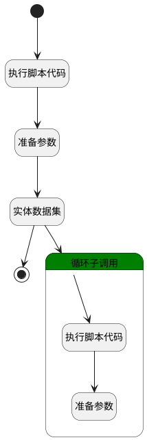

## 获取活跃成员图表数据 <!-- {docsify-ignore-all} -->

   获取活跃成员图表中所需要的数据

### 处理过程




### 处理步骤说明

#### 开始 :id=Begin<sup class="footnote-symbol"> <font color=gray size=1>[开始]</font></sup>


*- N/A*
#### 执行脚本代码 :id=RAWSFCODE1<sup class="footnote-symbol"> <font color=gray size=1>[直接后台代码]</font></sup>


<p class="panel-title"><b>执行代码[JavaScript]</b></p>

```javascript
null
```

#### 准备参数 :id=PREPAREPARAM1<sup class="footnote-symbol"> <font color=gray size=1>[准备参数]</font></sup>


    无

#### 结束 :id=END1<sup class="footnote-symbol"> <font color=gray size=1>[结束]</font></sup>


返回 `active_page(当前用户分页结果)`

#### 实体数据集 :id=DEDATASET1<sup class="footnote-symbol"> <font color=gray size=1>[实体数据集]</font></sup>


调用实体 [登录日志(LOGIN_LOG)](module/Base/login_log.md) 数据集合 [数据集(DEFAULT)](module/Base/login_log#数据集合) ，查询参数为`Default(传入变量)`

将执行结果返回给参数`active_page(当前用户分页结果)`

#### 循环子调用 :id=LOOPSUBCALL1<sup class="footnote-symbol"> <font color=gray size=1>[循环子调用]</font></sup>


循环参数`active_page(当前用户分页结果)`，子循环参数使用`active_obj(当前用户数据变量)`
#### 执行脚本代码 :id=RAWSFCODE2<sup class="footnote-symbol"> <font color=gray size=1>[直接后台代码]</font></sup>


<p class="panel-title"><b>执行代码[JavaScript]</b></p>

```javascript
null
```

#### 准备参数 :id=PREPAREPARAM2<sup class="footnote-symbol"> <font color=gray size=1>[准备参数]</font></sup>


    无


### 实体逻辑参数

|    中文名   |    代码名    |  数据类型    |  实体   |备注 |
| --------| --------| -------- | -------- | --------   |
|传入变量(<i class="fa fa-check"/></i>)|Default|过滤器|||
|当前用户数据变量|active_obj|数据对象|[登录日志(LOGIN_LOG)](module/Base/login_log.md)||
|当前用户分页结果|active_page|分页查询|||
