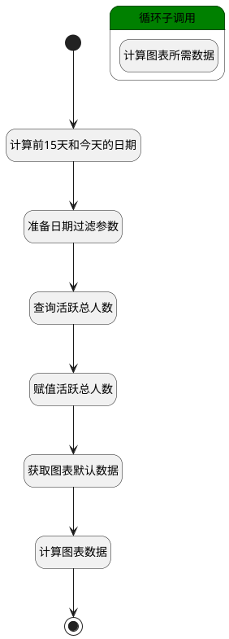

## 计算活跃成员图表数据 <!-- {docsify-ignore-all} -->

   计算活跃成员模块下的图表所需要的数据

### 处理过程




### 处理步骤说明

#### 开始 :id=Begin<sup class="footnote-symbol"> <font color=gray size=1>[开始]</font></sup>


*- N/A*
#### 计算前15天和今天的日期 :id=RAWSFCODE1<sup class="footnote-symbol"> <font color=gray size=1>[直接后台代码]</font></sup>


<p class="panel-title"><b>执行代码[JavaScript]</b></p>

```javascript
// 创建一个新的 Date 对象，获取前15天的日期 
var fifty = new Date();  
// 获取前15天的日期  
fifty.setDate(fifty.getDate() - 15);  
// 获取年、月、日信息  
var year = fifty.getFullYear();  
var month = fifty.getMonth() + 1;  
var day = fifty.getDate();  
if (month < 10) {
    month = '0' + month;
}
if (day < 10) {
    day = '0' + day;
}
// 创建一个新的 Date 对象，获取今天的日期 
var today = new Date();  
// 获取年、月、日信息  
var todayYear = today.getFullYear();  
var todayMonth = today.getMonth() + 1;  
var todayDay = today.getDate();  
if (todayMonth < 10) {
    todayMonth = '0' + todayMonth;
}
if (todayDay < 10) {
    todayDay = '0' + todayDay;
}
// 生成日期字符串，格式为 YYYY-MM-DD
var dateStr = year + '-' + month + '-' + day;
var todayDateStr = todayYear + '-' + todayMonth + '-' + todayDay;

var beforefiftyday = dateStr + ' 00:00:00';
var todays =  todayDateStr + ' 23:59:59';


logic.setParam('starttime',beforefiftyday);
logic.setParam('endtime',todays)
```

#### 准备日期过滤参数 :id=PREPAREPARAM1<sup class="footnote-symbol"> <font color=gray size=1>[准备参数]</font></sup>


1. 将`starttime(开始时间)` 设置给  `Default(传入变量).n_authtime_gtandeq`
2. 将`endtime(结束时间)` 设置给  `Default(传入变量).n_authtime_ltandeq`
3. 将`1` 设置给  `user_filter(过滤器).size`

#### 查询活跃总人数 :id=DEDATASET2<sup class="footnote-symbol"> <font color=gray size=1>[实体数据集]</font></sup>


调用实体 [企业用户(USER)](module/Base/user.md) 数据集合 [数据集(DEFAULT)](module/Base/user#数据集合) ，查询参数为`user_filter(过滤器)`

将执行结果返回给参数`user_page(用户分页查询结果变量)`

#### 赋值活跃总人数 :id=PREPAREPARAM2<sup class="footnote-symbol"> <font color=gray size=1>[准备参数]</font></sup>


1. 将`user_page(用户分页查询结果变量).total` 设置给  `user_total(用户总人数).total`

#### 获取图表默认数据 :id=DEDATASET1<sup class="footnote-symbol"> <font color=gray size=1>[实体数据集]</font></sup>


调用实体 [登录日志(LOGIN_LOG)](module/Base/login_log.md) 数据集合 [获取活跃人员图表数据(ECHARTS_DATAS)](module/Base/login_log#数据集合) ，查询参数为`Default(传入变量)`

将执行结果返回给参数`echart_page(图表分页查询结果变量)`

#### 计算图表数据 :id=RAWSFCODE_01<sup class="footnote-symbol"> <font color=gray size=1>[直接后台代码]</font></sup>


<p class="panel-title"><b>执行代码[Groovy]</b></p>

```groovy
// 从逻辑参数获取数据集
def echart_page = logic.param('echart_page').getReal()

// 活跃总人数
def user_total = logic.param('user_total').getReal()
def total = user_total.get('total')

echart_page.eachWithIndex { currentRow, i ->
     // 计算活跃率
    def active_members = currentRow.get('active_members') ?: 0 
    def active_rate = total > 0 ?  (active_members.toDouble() / total.toDouble() * 100).round(2) :  "0.00"
    currentRow.set("active_rate", active_rate)  
}

 
```

#### 结束 :id=END1<sup class="footnote-symbol"> <font color=gray size=1>[结束]</font></sup>


返回 `echart_page(图表分页查询结果变量)`

#### 循环子调用 :id=LOOPSUBCALL1<sup class="footnote-symbol"> <font color=gray size=1>[循环子调用]</font></sup>


循环参数`echart_page(图表分页查询结果变量)`，子循环参数使用`echart_obj(图表数据变量)`
#### 计算图表所需数据 :id=RAWSFCODE2<sup class="footnote-symbol"> <font color=gray size=1>[直接后台代码]</font></sup>


<p class="panel-title"><b>执行代码[JavaScript]</b></p>

```javascript
var echart_obj = logic.getParam('echart_obj');
//活跃总人数
var user_total = logic.getParam('user_total');
var total = user_total.get('total');
//活跃人数
var active_members = echart_obj.get('active_members');
//计算活跃率
var active_rate = ((active_members / total) * 100).toFixed(2); 
//补充活跃率
echart_obj.set("active_rate",active_rate);

//处理authtime
var newdate = String(echart_obj.get('auth_time')).split(' ')[0]; 
echart_obj.set("auth_time",newdate);
```


### 实体逻辑参数

|    中文名   |    代码名    |  数据类型    |  实体   |备注 |
| --------| --------| -------- | -------- | --------   |
|传入变量(<i class="fa fa-check"/></i>)|Default|过滤器|||
|图表数据变量|echart_obj|数据对象|[登录日志(LOGIN_LOG)](module/Base/login_log.md)||
|图表分页查询结果变量|echart_page|分页查询|||
|结束时间|endtime|简单数据|||
|开始时间|starttime|简单数据|||
|过滤器|user_filter|过滤器|||
|用户分页查询结果变量|user_page|分页查询|||
|用户总人数|user_total|数据对象|[企业用户(USER)](module/Base/user.md)||
