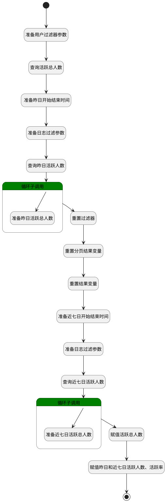

## 计算活跃成员数据信息 <!-- {docsify-ignore-all} -->

   获取活跃成员下的昨日活跃人数、昨日活跃率、活跃总人数、近七日活跃人数、近七日活跃率的数值

### 处理过程




### 处理步骤说明

#### 开始 :id=Begin<sup class="footnote-symbol"> <font color=gray size=1>[开始]</font></sup>


*- N/A*
#### 准备用户过滤器参数 :id=PREPAREPARAM1<sup class="footnote-symbol"> <font color=gray size=1>[准备参数]</font></sup>


1. 将`1` 设置给  `user_filter(用户过滤条件).size`

#### 查询活跃总人数 :id=DEDATASET1<sup class="footnote-symbol"> <font color=gray size=1>[实体数据集]</font></sup>


调用实体 [企业用户(USER)](module/Base/user.md) 数据集合 [数据集(DEFAULT)](module/Base/user#数据集合) ，查询参数为`user_filter(用户过滤条件)`

将执行结果返回给参数`user_page(用户分页结果变量)`

#### 准备昨日活跃总人数 :id=PREPAREPARAM4<sup class="footnote-symbol"> <font color=gray size=1>[准备参数]</font></sup>


1. 将`login_log_obj(日志结果变量).ACTIVE_MEMBERS(活跃成员数)` 设置给  `last_active_members(昨日活跃人数).ACTIVE_MEMBERS(活跃成员数)`

#### 循环子调用 :id=LOOPSUBCALL1<sup class="footnote-symbol"> <font color=gray size=1>[循环子调用]</font></sup>


循环参数`login_log_page(日志分页结果变量)`，子循环参数使用`login_log_obj(日志结果变量)`
#### 查询昨日活跃人数 :id=DEDATASET2<sup class="footnote-symbol"> <font color=gray size=1>[实体数据集]</font></sup>


调用实体 [登录日志(LOGIN_LOG)](module/Base/login_log.md) 数据集合 [获取活跃人员图表数据(ECHARTS_DATAS)](module/Base/login_log#数据集合) ，查询参数为`login_log_filter(日志过滤条件)`

将执行结果返回给参数`login_log_page(日志分页结果变量)`

#### 准备日志过滤参数 :id=PREPAREPARAM3<sup class="footnote-symbol"> <font color=gray size=1>[准备参数]</font></sup>


1. 将`last_day_starttime(昨日开始时间)` 设置给  `login_log_filter(日志过滤条件).n_authtime_gtandeq`
2. 将`last_day_endtime(昨日结束时间)` 设置给  `login_log_filter(日志过滤条件).n_authtime_ltandeq`

####  准备昨日开始结束时间 :id=RAWSFCODE1<sup class="footnote-symbol"> <font color=gray size=1>[直接后台代码]</font></sup>


<p class="panel-title"><b>执行代码[JavaScript]</b></p>

```javascript
// 创建一个新的 Date 对象，包含当前的日期和时间  
var lastday = new Date();  
// 获取昨天的日期  
lastday.setDate(lastday.getDate() - 1);  
// 获取年、月、日信息  
var year = lastday.getFullYear();  
var month = lastday.getMonth() + 1;  
var day = lastday.getDate();  
if (month < 10) {
    month = '0' + month;
}
if (day < 10) {
    day = '0' + day;
}

// 生成日期字符串，格式为 YYYY-MM-DD
var dateStr = year + '-' + month + '-' + day;
var lastdayFirst = dateStr + ' 00:00:00';
var lastdayLast =  dateStr + ' 23:59:59';

logic.setParam('last_day_starttime',lastdayFirst);
logic.setParam('last_day_endtime',lastdayLast)


```

#### 重置过滤器 :id=RENEWPARAM1<sup class="footnote-symbol"> <font color=gray size=1>[重新建立参数]</font></sup>


重建参数```login_log_filter(日志过滤条件)```
#### 重置分页结果变量 :id=RENEWPARAM2<sup class="footnote-symbol"> <font color=gray size=1>[重新建立参数]</font></sup>


重建参数```login_log_page(日志分页结果变量)```
#### 重置结果变量 :id=RENEWPARAM3<sup class="footnote-symbol"> <font color=gray size=1>[重新建立参数]</font></sup>


重建参数```login_log_obj(日志结果变量)```
#### 准备近七日开始结束时间 :id=RAWSFCODE3<sup class="footnote-symbol"> <font color=gray size=1>[直接后台代码]</font></sup>


<p class="panel-title"><b>执行代码[JavaScript]</b></p>

```javascript
// 创建一个新的 Date 对象，包含当前的日期和时间  
var sevenday = new Date();  
// 获取前6天的日期  
sevenday.setDate(sevenday.getDate() - 6);  
// 获取年、月、日信息  
var year = sevenday.getFullYear();  
var month = sevenday.getMonth() + 1;  
var day = sevenday.getDate();  
if (month < 10) {
    month = '0' + month;
}
if (day < 10) {
    day = '0' + day;
}
// 生成日期字符串，格式为 YYYY-MM-DD
var dateStr = year + '-' + month + '-' + day;
var sevendayFirst = dateStr + ' 00:00:00';


// 创建一个新的 Date 对象，包含当前的日期和时间  
var today = new Date();  
// 获取年、月、日信息  
var todayyear = today.getFullYear();  
var todaymonth = today.getMonth() + 1;  
var todayday = today.getDate();  
if (todaymonth < 10) {
    todaymonth = '0' + todaymonth;
}
if (todayday < 10) {
    todayday = '0' + todayday;
}
// 生成日期字符串，格式为 YYYY-MM-DD
var enddate = todayyear + '-' + todaymonth + '-' + todayday + ' 23:59:59';

logic.setParam('seven_day_starttime',sevendayFirst);
logic.setParam('seven_day_endtime',enddate)


```

#### 准备近七日活跃总人数 :id=PREPAREPARAM6<sup class="footnote-symbol"> <font color=gray size=1>[准备参数]</font></sup>


1. 将`login_log_obj(日志结果变量).ACTIVE_MEMBERS(活跃成员数)` 设置给  `seven_active_members(近七日活跃人数).ACTIVE_MEMBERS(活跃成员数)`

#### 循环子调用 :id=LOOPSUBCALL2<sup class="footnote-symbol"> <font color=gray size=1>[循环子调用]</font></sup>


循环参数`login_log_page(日志分页结果变量)`，子循环参数使用`login_log_obj(日志结果变量)`
#### 查询近七日活跃人数 :id=DEDATASET3<sup class="footnote-symbol"> <font color=gray size=1>[实体数据集]</font></sup>


调用实体 [登录日志(LOGIN_LOG)](module/Base/login_log.md) 数据集合 [排重用户(DISTINCT_USERID)](module/Base/login_log#数据集合) ，查询参数为`login_log_filter(日志过滤条件)`

将执行结果返回给参数`login_log_page(日志分页结果变量)`

#### 准备日志过滤参数 :id=PREPAREPARAM5<sup class="footnote-symbol"> <font color=gray size=1>[准备参数]</font></sup>


1. 将`seven_day_starttime(近七日开始时间)` 设置给  `login_log_filter(日志过滤条件).n_authtime_gtandeq`
2. 将`seven_day_endtime(近七日结束时间)` 设置给  `login_log_filter(日志过滤条件).n_authtime_ltandeq`

#### 赋值活跃总人数 :id=PREPAREPARAM2<sup class="footnote-symbol"> <font color=gray size=1>[准备参数]</font></sup>


1. 将`user_page(用户分页结果变量).total` 设置给  `datas(返回结果数据).active_count`

#### 赋值昨日和近七日活跃人数、活跃率 :id=RAWSFCODE2<sup class="footnote-symbol"> <font color=gray size=1>[直接后台代码]</font></sup>


<p class="panel-title"><b>执行代码[JavaScript]</b></p>

```javascript
var datas = logic.getParam('datas');
var last_active_members = logic.getParam('last_active_members');
var seven_active_members = logic.getParam('seven_active_members');
//活跃总人数
var active_count = datas.get('active_count');
//昨日活跃人数
var lastday_count = last_active_members.get('ACTIVE_MEMBERS');
//昨日活跃率
var lastday_rate = ((lastday_count / active_count) * 100).toFixed(2);
//设置昨日活跃人数和活跃率
datas.set("lastday_active_count",lastday_count);
datas.set("lastday_active_rate",lastday_rate);
//近七日活跃人数
var sevenday_count = seven_active_members.get('ACTIVE_MEMBERS');
//近七日活跃率
var sevenday_rate = ((sevenday_count / active_count) * 100).toFixed(2);
//设置近七日活跃人数和活跃率
datas.set("sevenday_active_count",sevenday_count);
datas.set("sevenday_active_rate",sevenday_rate);

```

#### 结束 :id=END1<sup class="footnote-symbol"> <font color=gray size=1>[结束]</font></sup>


返回 `datas(返回结果数据)`


### 实体逻辑参数

|    中文名   |    代码名    |  数据类型    |  实体   |备注 |
| --------| --------| -------- | -------- | --------   |
|传入变量(<i class="fa fa-check"/></i>)|Default|数据对象|[登录日志(LOGIN_LOG)](module/Base/login_log.md)||
|返回结果数据|datas|数据对象|[登录日志(LOGIN_LOG)](module/Base/login_log.md)||
|昨日活跃人数|last_active_members|数据对象|[登录日志(LOGIN_LOG)](module/Base/login_log.md)||
|昨日结束时间|last_day_endtime|简单数据|||
|昨日开始时间|last_day_starttime|简单数据|||
|日志过滤条件|login_log_filter|过滤器|||
|日志结果变量|login_log_obj|数据对象|[登录日志(LOGIN_LOG)](module/Base/login_log.md)||
|日志分页结果变量|login_log_page|分页查询|||
|近七日活跃人数|seven_active_members|数据对象|[登录日志(LOGIN_LOG)](module/Base/login_log.md)||
|近七日结束时间|seven_day_endtime|简单数据|||
|近七日开始时间|seven_day_starttime|简单数据|||
|用户过滤条件|user_filter|过滤器|||
|用户分页结果变量|user_page|分页查询|||
