## 计算活跃成员数据信息 <!-- {docsify-ignore-all} -->

   获取活跃成员下的昨日活跃人数、昨日活跃率、活跃总人数的数值

### 处理过程

```plantuml
@startuml
hide footbox
<style>
root {
  HyperlinkColor #42b983
}
</style>

hide empty description
state "开始" as Begin <<start>> [[$./calc_active_member_info#begin {开始}]]
state "实体行为" as DEACTION1  [[$./calc_active_member_info#deaction1 {实体行为}]]
state "结束" as END1 <<end>> [[$./calc_active_member_info#end1 {结束}]]
state "注入脚本代码" as RAWJSCODE1  [[$./calc_active_member_info#rawjscode1 {注入脚本代码}]]


Begin --> DEACTION1
DEACTION1 --> RAWJSCODE1
RAWJSCODE1 --> END1


@enduml
```




### 处理步骤说明

#### 开始 :id=Begin<sup class="footnote-symbol"> <font color=gray size=1>[开始]</font></sup>


#### 实体行为 :id=DEACTION1<sup class="footnote-symbol"> <font color=gray size=1>[实体行为]</font></sup>


调用实体 [登录日志(LOGIN_LOG)](module/Base/login_log.md) 行为 [获取活跃成员数据(active_member)](module/Base/login_log#行为) 

将执行结果返回给参数`datas(返回数据)`

#### 注入脚本代码 :id=RAWJSCODE1<sup class="footnote-symbol"> <font color=gray size=1>[直接前台代码]</font></sup>


<p class="panel-title"><b>执行代码</b></p>

```javascript
let nums = uiLogic.view.layoutPanel.panelItems;
if (uiLogic && uiLogic.datas.lastday_active_count) {
    //昨日活跃人数
    nums.lastday_active_count.data.lastday_active_count = uiLogic.datas.lastday_active_count;
}
if (uiLogic && uiLogic.datas.lastday_active_rate) {
    //昨日活跃率
    nums.lastday_active_rate.data.lastday_active_rate = uiLogic.datas.lastday_active_rate;
}
if (uiLogic && uiLogic.datas.sevenday_active_count) {
    //近七日活跃人数
    nums.sevenday_active_count.data.sevenday_active_count = Math.floor(uiLogic.datas.sevenday_active_count);
}
if (uiLogic && uiLogic.datas.sevenday_active_rate) {
    //近七日活跃率
    nums.sevenday_active_rate.data.sevenday_active_rate = uiLogic.datas.sevenday_active_rate;
}


      
    

```

#### 结束 :id=END1<sup class="footnote-symbol"> <font color=gray size=1>[结束]</font></sup>


### 实体逻辑参数

|    中文名   |    代码名    |  数据类型      |备注 |
| --------| --------| --------  | --------   |
|传入变量(<i class="fa fa-check"/></i>)|Default|数据对象||
|view|view|当前视图对象||
|返回数据|datas|数据对象||
