## 添加共享页面非空间下成员 <!-- {docsify-ignore-all} -->

   添加共享页面非空间下成员

### 处理过程

```plantuml
@startuml
hide empty description
<style>
root {
  HyperlinkColor #42b983
}
</style>

hide empty description
state "开始" as Begin <<start>> [[$./add_shared_page_member#begin {"开始"}]]
state "添加共享页面成员" as RAWSFCODE1  [[$./add_shared_page_member#rawsfcode1 {"添加共享页面成员"}]]
state "结束" as END1 <<end>> [[$./add_shared_page_member#end1 {"结束"}]]


Begin --> RAWSFCODE1 : [[$./add_shared_page_member#begin-rawsfcode1{已选择用户} 已选择用户]]
RAWSFCODE1 --> END1


@enduml
```




### 处理步骤说明

#### 开始 :id=Begin<sup class="footnote-symbol"> <font color=gray size=1>[开始]</font></sup>


*- N/A*
#### 添加共享页面成员 :id=RAWSFCODE1<sup class="footnote-symbol"> <font color=gray size=1>[直接后台代码]</font></sup>


<p class="panel-title"><b>执行代码[Groovy]</b></p>

```groovy
def _default = logic.param('Default').getReal()
def choose_member = _default.get('choose_member')
def choose_member_ids = _default.get('choose_member_ids')
def member_ids = choose_member_ids.split(',')
def member_names = choose_member.split(',')
def member_runtime = sys.dataentity('member')
if(_default.get('shared_page') != null){
    member_ids.eachWithIndex { item, index ->
        def newMember = member_runtime.entity()
        newMember.set('owner_type', 'PAGE')
        newMember.set('role_id', _default.get('check_type', 'reader'))
        newMember.set('owner_subtype', 'SHARED')
        newMember.set('owner_id', _default.get('shared_page'))
        newMember.set('user_id', item) 
        newMember.set('name', member_names[index])
        member_runtime.save(newMember)
    }

}

```

#### 结束 :id=END1<sup class="footnote-symbol"> <font color=gray size=1>[结束]</font></sup>


返回 `Default(传入变量)`


### 连接条件说明
#### 已选择用户 :id=Begin-RAWSFCODE1

`Default(传入变量).choose_member_ids` ISNOTNULL


### 实体逻辑参数

|    中文名   |    代码名    |  数据类型    |  实体   |备注 |
| --------| --------| -------- | -------- | --------   |
|传入变量(<i class="fa fa-check"/></i>)|Default|数据对象|[成员(MEMBER)](module/Base/member.md)||
