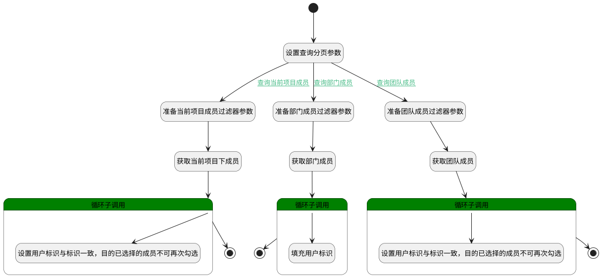

## 选择项目资源成员 <!-- {docsify-ignore-all} -->

   项目资源分配下设置成员：当前项目下成员/部门/团队

### 处理过程

### 处理步骤说明

#### 开始 :id=Begin [开始]

*- N/A*
#### 设置查询分页参数 :id=PREPAREPARAM5 [准备参数]

1. 将`1000` 设置给  `project_member_filter(项目成员过滤器).size`
2. 将`1000` 设置给  `Default(传入变量).size`
3. 将`1000` 设置给  `user_filter(用户过滤器).size`
4. 将`0` 设置给  `project_member_filter(项目成员过滤器).page`
5. 将`0` 设置给  `Default(传入变量).page`
6. 将`0` 设置给  `user_filter(用户过滤器).page`

#### 准备当前项目成员过滤器参数 :id=PREPAREPARAM1 [准备参数]

1. 将`Default(传入变量).cur_project` 设置给  `project_member_filter(项目成员过滤器).n_project_id_eq`
2. 将`Default(传入变量).n_name_like` 设置给  `project_member_filter(项目成员过滤器).n_name_like`

#### 准备部门成员过滤器参数 :id=PREPAREPARAM2 [准备参数]

1. 将`Default(传入变量).n_department_id_eq` 设置给  `user_filter(用户过滤器).n_department_id_eq`
2. 将`Default(传入变量).n_name_like` 设置给  `user_filter(用户过滤器).n_display_name_like`

#### 准备团队成员过滤器参数 :id=PREPAREPARAM3 [准备参数]

1. 将`Default(传入变量).user_group` 设置给  `Default(传入变量).n_owner_id_eq`
2. 将`GROUP` 设置给  `Default(传入变量).n_owner_type_eq`

#### 获取当前项目下成员 :id=DEDATASET1 [实体数据集]

调用实体 [项目成员(PROJECT_MEMBER)](module/ProjMgmt/project_member.md) 数据集合 [数据集(DEFAULT)](module/ProjMgmt/project_member#数据集合) ，查询参数为`project_member_filter(项目成员过滤器)`

将执行结果返回给参数`project_member_page(项目成员分页查询结果变量)`

#### 获取部门成员 :id=DEDATASET2 [实体数据集]

调用实体 [企业用户(USER)](module/Base/user.md) 数据集合 [数据集(DEFAULT)](module/Base/user#数据集合) ，查询参数为`user_filter(用户过滤器)`

将执行结果返回给参数`user_page(部门成员分页查询结果变量)`

#### 获取团队成员 :id=DEDATASET3 [实体数据集]

调用实体 [成员(MEMBER)](module/Base/member.md) 数据集合 [数据集(DEFAULT)](module/Base/member#数据集合) ，查询参数为`Default(传入变量)`

将执行结果返回给参数`group_page(团队成员分页查询结果变量)`

#### 设置用户标识与标识一致，目的已选择的成员不可再次勾选 :id=PREPAREPARAM7 [准备参数]

1. 将`for_project_member(项目成员循环变量).USER_ID(登录名)` 设置给  `for_project_member(项目成员循环变量).ID(标识)`

#### 循环子调用 :id=LOOPSUBCALL3 [循环子调用]

循环参数`project_member_page(项目成员分页查询结果变量)`，子循环参数使用`for_project_member(项目成员循环变量)`
#### 循环子调用 :id=LOOPSUBCALL1 [循环子调用]

循环参数`user_page(部门成员分页查询结果变量)`，子循环参数使用`for_user_obj(部门成员循环临时变量)`
#### 循环子调用 :id=LOOPSUBCALL2 [循环子调用]

循环参数`group_page(团队成员分页查询结果变量)`，子循环参数使用`for_member(成员循环变量)`
#### 设置用户标识与标识一致，目的已选择的成员不可再次勾选 :id=PREPAREPARAM6 [准备参数]

1. 将`for_member(成员循环变量).USER_ID(登录名)` 设置给  `for_member(成员循环变量).ID(标识)`

#### 填充用户标识 :id=PREPAREPARAM4 [准备参数]

1. 将`for_user_obj(部门成员循环临时变量).DISPLAY_NAME(姓名)` 设置给  `for_user_obj(部门成员循环临时变量).NAME(登录名)`
2. 将`for_user_obj(部门成员循环临时变量).ID(标识)` 设置给  `for_user_obj(部门成员循环临时变量).user_id(用户ID)`

#### 结束 :id=END1 [结束]

返回 `project_member_page(项目成员分页查询结果变量)`

#### 结束 :id=END2 [结束]

返回 `user_page(部门成员分页查询结果变量)`

#### 结束 :id=END3 [结束]

返回 `group_page(团队成员分页查询结果变量)`

### 连接条件说明
#### 查询当前项目成员 :id=PREPAREPARAM5-PREPAREPARAM1

`Default(传入变量).cur_project` ISNOTNULL
#### 查询团队成员 :id=PREPAREPARAM5-PREPAREPARAM3

`Default(传入变量).user_group` ISNOTNULL
#### 查询部门成员 :id=PREPAREPARAM5-PREPAREPARAM2

`Default(传入变量).n_department_id_eq` ISNOTNULL

### 实体逻辑参数

|    中文名   |    代码名    |  数据类型    |  实体   |备注 |
| --------| --------| -------- | -------- | --------   |
|传入变量(<i class="fa fa-check"/></i>)|Default|过滤器|||
|成员循环变量|for_member|数据对象|[成员(MEMBER)](module/Base/member.md)||
|项目成员循环变量|for_project_member|数据对象|[项目成员(PROJECT_MEMBER)](module/ProjMgmt/project_member.md)||
|部门成员循环临时变量|for_user_obj|数据对象|[企业用户(USER)](module/Base/user.md)||
|团队成员分页查询结果变量|group_page|分页查询|||
|项目成员过滤器|project_member_filter|过滤器|||
|项目成员分页查询结果变量|project_member_page|分页查询|||
|用户过滤器|user_filter|过滤器|||
|部门成员分页查询结果变量|user_page|分页查询|||
