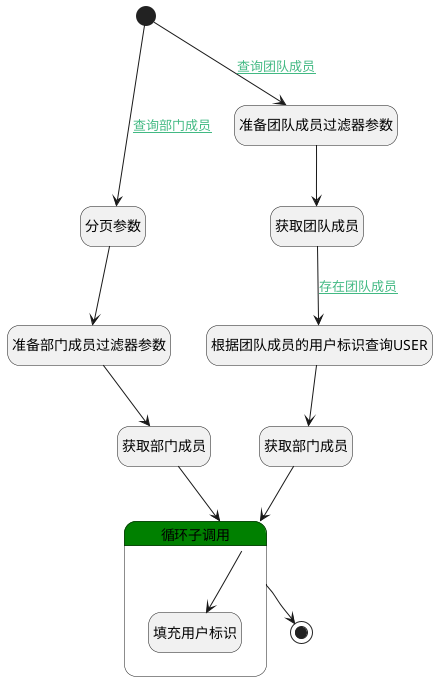

## 选择资源成员（全局） <!-- {docsify-ignore-all} -->

   选择资源成员（全局）

### 处理过程




### 处理步骤说明

#### 开始 :id=Begin<sup class="footnote-symbol"> <font color=gray size=1>[开始]</font></sup>


*- N/A*
#### 分页参数 :id=RAWSFCODE2<sup class="footnote-symbol"> <font color=gray size=1>[直接后台代码]</font></sup>


<p class="panel-title"><b>执行代码[Groovy]</b></p>

```groovy
def _default = logic.param('default').getReal()
def user_filter = logic.param('user_filter').getReal()
user_filter.setPageable(_default.getPageable())

```

#### 准备团队成员过滤器参数 :id=PREPAREPARAM3<sup class="footnote-symbol"> <font color=gray size=1>[准备参数]</font></sup>


1. 将`Default(传入变量).user_group` 设置给  `Default(传入变量).n_owner_id_eq`
2. 将`100` 设置给  `user_filter(用户过滤器).size`
3. 将`GROUP` 设置给  `Default(传入变量).n_owner_type_eq`

#### 准备部门成员过滤器参数 :id=PREPAREPARAM2<sup class="footnote-symbol"> <font color=gray size=1>[准备参数]</font></sup>


1. 将`Default(传入变量).n_department_id_eq` 设置给  `user_filter(用户过滤器).n_department_id_eq`
2. 将`1` 设置给  `user_filter(用户过滤器).n_status_eq`
3. 将`Default(传入变量).n_name_like` 设置给  `user_filter(用户过滤器).n_display_name_like`

#### 获取团队成员 :id=DEDATASET3<sup class="footnote-symbol"> <font color=gray size=1>[实体数据集]</font></sup>


调用实体 [成员(MEMBER)](module/Base/member.md) 数据集合 [数据集(DEFAULT)](module/Base/member#数据集合) ，查询参数为`Default(传入变量)`

将执行结果返回给参数`group_page(团队成员分页查询结果变量)`

#### 获取部门成员 :id=DEDATASET2<sup class="footnote-symbol"> <font color=gray size=1>[实体数据集]</font></sup>


调用实体 [企业用户(USER)](module/Base/user.md) 数据集合 [数据集(DEFAULT)](module/Base/user#数据集合) ，查询参数为`user_filter(用户过滤器)`

将执行结果返回给参数`user_page(部门成员分页查询结果变量)`

#### 根据团队成员的用户标识查询USER :id=RAWSFCODE3<sup class="footnote-symbol"> <font color=gray size=1>[直接后台代码]</font></sup>


<p class="panel-title"><b>执行代码[JavaScript]</b></p>

```javascript
var group_page = logic.getParam("group_page");
var user_filter = logic.getParam("user_filter");
var user_ids = "";
for (var i = 0; i < group_page.length; i++) {
    if(i>0){
        user_ids = user_ids+",";
    }
    var _group_member = group_page.get(i);
    user_ids = user_ids + _group_member.get("user_id");
}
if(user_ids != ""){
    user_filter.in("id",user_ids);
}
```

#### 获取部门成员 :id=DEDATASET4<sup class="footnote-symbol"> <font color=gray size=1>[实体数据集]</font></sup>


调用实体 [企业用户(USER)](module/Base/user.md) 数据集合 [数据集(DEFAULT)](module/Base/user#数据集合) ，查询参数为`user_filter(用户过滤器)`

将执行结果返回给参数`user_page(部门成员分页查询结果变量)`

#### 循环子调用 :id=LOOPSUBCALL1<sup class="footnote-symbol"> <font color=gray size=1>[循环子调用]</font></sup>


循环参数`user_page(部门成员分页查询结果变量)`，子循环参数使用`for_user_obj(部门成员循环临时变量)`
#### 填充用户标识 :id=PREPAREPARAM4<sup class="footnote-symbol"> <font color=gray size=1>[准备参数]</font></sup>


1. 将`for_user_obj(部门成员循环临时变量).DISPLAY_NAME(姓名)` 设置给  `for_user_obj(部门成员循环临时变量).NAME(登录名)`
2. 将`for_user_obj(部门成员循环临时变量).ID(标识)` 设置给  `for_user_obj(部门成员循环临时变量).user_id(用户ID)`

#### 结束 :id=END2<sup class="footnote-symbol"> <font color=gray size=1>[结束]</font></sup>


返回 `user_page(部门成员分页查询结果变量)`


### 连接条件说明
#### 查询团队成员 :id=Begin-PREPAREPARAM3

`Default(传入变量).user_group` ISNOTNULL
#### 存在团队成员 :id=DEDATASET3-RAWSFCODE3

`group_page(团队成员分页查询结果变量).size` GT `0`
#### 查询部门成员 :id=Begin-RAWSFCODE2

(`Default(传入变量).n_department_id_eq` ISNOTNULL OR `Default(传入变量).department` ISNOTNULL)


### 实体逻辑参数

|    中文名   |    代码名    |  数据类型    |  实体   |备注 |
| --------| --------| -------- | -------- | --------   |
|传入变量(<i class="fa fa-check"/></i>)|Default|过滤器|||
|成员循环变量|for_member|数据对象|[成员(MEMBER)](module/Base/member.md)||
|部门成员循环临时变量|for_user_obj|数据对象|[企业用户(USER)](module/Base/user.md)||
|团队成员分页查询结果变量|group_page|分页查询|||
|用户过滤器|user_filter|过滤器|||
|部门成员分页查询结果变量|user_page|分页查询|||
