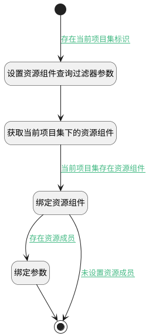

## 获取当前项目集下资源成员 <!-- {docsify-ignore-all} -->

   获取当前项目集下资源成员

### 处理过程

### 处理步骤说明

#### 开始 :id=Begin [开始]

*- N/A*
#### 设置资源组件查询过滤器参数 :id=PREPAREPARAM1 [准备参数]

1. 将`Default(传入变量).portfolio_id` 设置给  `addon_resource_filter(资源组件过滤器).n_owner_id_eq`
2. 将`portfolio` 设置给  `addon_resource_filter(资源组件过滤器).n_owner_type_eq`
3. 将`resource` 设置给  `addon_resource_filter(资源组件过滤器).n_addon_type_eq`

#### 获取当前项目集下的资源组件 :id=DEDATASET1 [实体数据集]

调用实体 [资源组件(ADDON_RESOURCE)](module/Base/addon_resource.md) 数据集合 [数据集(DEFAULT)](module/Base/addon_resource#数据集合) ，查询参数为`addon_resource_filter(资源组件过滤器)`

将执行结果返回给参数`addon_resource_page(资源组件分页查询结果变量)`

#### 绑定资源组件 :id=BINDPARAM2 [绑定参数]

绑定参数`addon_resource_page(资源组件分页查询结果变量)` 到 `addon_resource(资源组件)`
#### 绑定参数 :id=BINDPARAM1 [绑定参数]

绑定参数`addon_resource(资源组件)` 到 `member_page(资源成员结果变量)`
#### 结束 :id=END1 [结束]

返回 `member_page(资源成员结果变量)`

### 连接条件说明
#### 存在当前项目集标识 :id=Begin-PREPAREPARAM1

`Default(传入变量).portfolio_id` ISNOTNULL
#### 当前项目集存在资源组件 :id=DEDATASET1-BINDPARAM2

`addon_resource_page(资源组件分页查询结果变量).size` GT `0`
#### 存在资源成员 :id=BINDPARAM2-BINDPARAM1

`addon_resource(资源组件).MEMBERS(资源成员)` ISNOTNULL
#### 未设置资源成员 :id=BINDPARAM2-END1

`addon_resource(资源组件).MEMBERS(资源成员)` ISNULL

### 实体逻辑参数

|    中文名   |    代码名    |  数据类型    |  实体   |备注 |
| --------| --------| -------- | -------- | --------   |
|传入变量(<i class="fa fa-check"/></i>)|Default|过滤器|||
|资源组件|addon_resource|数据对象|[资源组件(ADDON_RESOURCE)](module/Base/addon_resource.md)||
|资源组件过滤器|addon_resource_filter|过滤器|||
|资源组件分页查询结果变量|addon_resource_page|分页查询|||
|资源成员结果变量|member_page|分页查询|||
