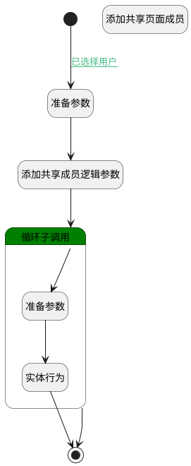

## 添加共享页面非空间下成员（移动端） <!-- {docsify-ignore-all} -->

   添加共享页面非空间下成员（移动端）

### 处理过程




### 处理步骤说明

#### 开始 :id=Begin<sup class="footnote-symbol"> <font color=gray size=1>[开始]</font></sup>


*- N/A*
#### 准备参数 :id=PREPAREPARAM1<sup class="footnote-symbol"> <font color=gray size=1>[准备参数]</font></sup>


1. 将`Default(传入变量).srfactionparam` 绑定给  `members(空间成员列表)`

#### 添加共享页面成员 :id=RAWSFCODE1<sup class="footnote-symbol"> <font color=gray size=1>[直接后台代码]</font></sup>


<p class="panel-title"><b>执行代码[Groovy]</b></p>

```groovy
def _default = logic.param('Default').getReal()
def choose_member = _default.get('choose_member')
def choose_member_ids = _default.get('choose_member_ids')
def member_ids = choose_member_ids.split(',')
def member_names = choose_member.split(',')
def member_runtime = sys.dataentity('member')
if(_default.get('shared_page') != null){
    member_ids.eachWithIndex { item, index ->
        def newMember = member_runtime.entity()
        newMember.set('owner_type', 'PAGE')
        newMember.set('role_id', _default.get('check_type', 'reader'))
        newMember.set('owner_subtype', 'SHARED')
        newMember.set('owner_id', _default.get('shared_page'))
        newMember.set('user_id', item) 
        newMember.set('name', member_names[index])
        member_runtime.save(newMember)
    }

}

```

#### 添加共享成员逻辑参数 :id=DEBUGPARAM1<sup class="footnote-symbol"> <font color=gray size=1>[调试逻辑参数]</font></sup>


> [!NOTE|label:调试信息|icon:fa fa-bug]
> 调试输出参数`Default(传入变量)`的详细信息


#### 循环子调用 :id=LOOPSUBCALL1<sup class="footnote-symbol"> <font color=gray size=1>[循环子调用]</font></sup>


循环参数`members(空间成员列表)`，子循环参数使用`user`
#### 结束 :id=END1<sup class="footnote-symbol"> <font color=gray size=1>[结束]</font></sup>


返回 `Default(传入变量)`

#### 准备参数 :id=PREPAREPARAM2<sup class="footnote-symbol"> <font color=gray size=1>[准备参数]</font></sup>


1. 将` ==> member` 重新建立为  `member(空间成员)`
2. 将`PAGE` 设置给  `member(空间成员).OWNER_TYPE(所属数据对象)`
3. 将`Default(传入变量).check_type` 设置给  `member(空间成员).ROLE_ID(角色)`
4. 将`SHARED` 设置给  `member(空间成员).OWNER_SUBTYPE(所属对象子类型)`
5. 将`Default(传入变量).shared_page` 设置给  `member(空间成员).OWNER_ID(所属数据标识)`
6. 将`user.ID(标识)` 设置给  `member(空间成员).USER_ID(登录名)`
7. 将`user.DISPLAY_NAME(姓名)` 设置给  `member(空间成员).NAME(名称)`

#### 实体行为 :id=DEACTION1<sup class="footnote-symbol"> <font color=gray size=1>[实体行为]</font></sup>


调用实体 [成员(MEMBER)](module/Base/member.md) 行为 [Save](module/Base/member#行为) ，行为参数为`member(空间成员)`


### 连接条件说明
#### 已选择用户 :id=Begin-PREPAREPARAM1

`Default(传入变量).srfactionparam` ISNOTNULL


### 实体逻辑参数

|    中文名   |    代码名    |  数据类型    |  实体   |备注 |
| --------| --------| -------- | -------- | --------   |
|传入变量(<i class="fa fa-check"/></i>)|Default|数据对象|[成员(MEMBER)](module/Base/member.md)||
|空间成员|member|数据对象|[成员(MEMBER)](module/Base/member.md)||
|空间成员列表|members|数据对象列表|[成员(MEMBER)](module/Base/member.md)||
|user|user|数据对象|[企业用户(USER)](module/Base/user.md)||
