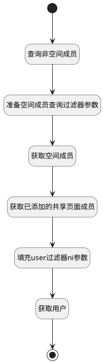

## 非空间下成员 <!-- {docsify-ignore-all} -->

   非空间下成员

### 处理过程




### 处理步骤说明

#### 开始 :id=Begin<sup class="footnote-symbol"> <font color=gray size=1>[开始]</font></sup>


*- N/A*
#### 查询非空间成员 :id=DEBUGPARAM1<sup class="footnote-symbol"> <font color=gray size=1>[调试逻辑参数]</font></sup>


> [!NOTE|label:调试信息|icon:fa fa-bug]
> 调试输出参数`Default(传入变量)`的详细信息


#### 准备空间成员查询过滤器参数 :id=PREPAREPARAM1<sup class="footnote-symbol"> <font color=gray size=1>[准备参数]</font></sup>


1. 将`Default(传入变量).space_id` 设置给  `space_member_filter(空间成员过滤器).n_space_id_eq`
2. 将`SHARED` 设置给  `shared_page_member_filter(共享页面成员).n_owner_subtype_eq`
3. 将`Default(传入变量).shared_page` 设置给  `shared_page_member_filter(共享页面成员).n_owner_id_eq`
4. 将`1000` 设置给  `shared_page_member_filter(共享页面成员).size`
5. 将`PAGE` 设置给  `shared_page_member_filter(共享页面成员).n_owner_type_eq`
6. 将`1000` 设置给  `space_member_filter(空间成员过滤器).size`

#### 获取空间成员 :id=DEDATASET1<sup class="footnote-symbol"> <font color=gray size=1>[实体数据集]</font></sup>


调用实体 [空间成员(SPACE_MEMBER)](module/Wiki/space_member.md) 数据集合 [数据集(DEFAULT)](module/Wiki/space_member#数据集合) ，查询参数为`space_member_filter(空间成员过滤器)`

将执行结果返回给参数`space_members(空间成员集合)`

#### 获取已添加的共享页面成员 :id=DEDATASET3<sup class="footnote-symbol"> <font color=gray size=1>[实体数据集]</font></sup>


调用实体 [成员(MEMBER)](module/Base/member.md) 数据集合 [数据集(DEFAULT)](module/Base/member#数据集合) ，查询参数为`shared_page_member_filter(共享页面成员)`

将执行结果返回给参数`shared_page_members(共享页面成员集合)`

#### 填充user过滤器ni参数 :id=RAWSFCODE1<sup class="footnote-symbol"> <font color=gray size=1>[直接后台代码]</font></sup>


<p class="panel-title"><b>执行代码[JavaScript]</b></p>

```javascript
var space_members = logic.getParam("space_members");
var shared_page_members = logic.getParam("shared_page_members");
var user_filter = logic.getParam("Default");
var user_ids = "";
for (var i = 0; i < space_members.length; i++) {
    if(i>0){
        user_ids = user_ids+",";
    }
    var space_member = space_members.get(i);
    user_ids = user_ids + space_member.get("user_id");
}
for (var i = 0; i < shared_page_members.length; i++) {
    if(user_ids != ""){
        user_ids = user_ids+",";
    }
    var shared_page_member = shared_page_members.get(i);
    user_ids = user_ids + shared_page_member.get("user_id");
}
if(user_ids != ""){
    user_filter.ni("id",user_ids);
}
```

#### 获取用户 :id=DEDATASET2<sup class="footnote-symbol"> <font color=gray size=1>[实体数据集]</font></sup>


调用实体 [成员(MEMBER)](module/Base/member.md) 数据集合 [数据集(DEFAULT)](module/Base/member#数据集合) ，查询参数为`Default(传入变量)`

将执行结果返回给参数`user_page(用户分页查询结果变量)`

#### 结束 :id=END1<sup class="footnote-symbol"> <font color=gray size=1>[结束]</font></sup>


返回 `user_page(用户分页查询结果变量)`


### 实体逻辑参数

|    中文名   |    代码名    |  数据类型    |  实体   |备注 |
| --------| --------| -------- | -------- | --------   |
|传入变量(<i class="fa fa-check"/></i>)|Default|过滤器|||
|共享页面成员|shared_page_member_filter|过滤器|||
|共享页面成员集合|shared_page_members|分页查询|||
|空间成员过滤器|space_member_filter|过滤器|||
|空间成员集合|space_members|分页查询|||
|用户分页查询结果变量|user_page|分页查询|||
