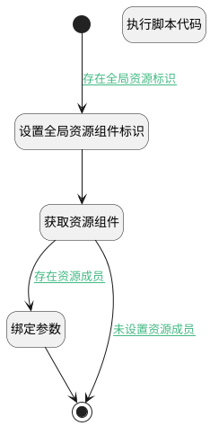

## 获取资源成员（全局） <!-- {docsify-ignore-all} -->

   获取资源成员（全局）

### 处理过程




### 处理步骤说明

#### 开始 :id=Begin<sup class="footnote-symbol"> <font color=gray size=1>[开始]</font></sup>


*- N/A*
#### 设置全局资源组件标识 :id=PREPAREPARAM1<sup class="footnote-symbol"> <font color=gray size=1>[准备参数]</font></sup>


1. 将`Default(传入变量).addon_resource` 设置给  `addon_resource(资源组件).ID(标识)`

#### 获取资源组件 :id=DEACTION1<sup class="footnote-symbol"> <font color=gray size=1>[实体行为]</font></sup>


调用实体 [资源组件(ADDON_RESOURCE)](module/Base/addon_resource.md) 行为 [Get](module/Base/addon_resource#行为) ，行为参数为`addon_resource(资源组件)`

将执行结果返回给参数`addon_resource(资源组件)`

#### 绑定参数 :id=BINDPARAM1<sup class="footnote-symbol"> <font color=gray size=1>[绑定参数]</font></sup>


绑定参数`addon_resource(资源组件)` 到 `member_page(资源成员结果变量)`
#### 结束 :id=END1<sup class="footnote-symbol"> <font color=gray size=1>[结束]</font></sup>


返回 `member_page(资源成员结果变量)`

#### 执行脚本代码 :id=RAWSFCODE1<sup class="footnote-symbol"> <font color=gray size=1>[直接后台代码]</font></sup>


<p class="panel-title"><b>执行代码[Groovy]</b></p>

```groovy
def _default = logic.param('Default').getReal();
def member_list = logic.param('member_list').getReal();

def id = _default.get('addon_resource');

def runtime = sys.dataentity('addon_resource');
def addon_resource = runtime.get(id)
def members = addon_resource.get('members');
if (members != null ) {
    members.each { item ->
        member_list.add(item)
    }
}
```


### 连接条件说明
#### 存在全局资源标识 :id=Begin-PREPAREPARAM1

`Default(传入变量).addon_resource` ISNOTNULL
#### 存在资源成员 :id=DEACTION1-BINDPARAM1

`addon_resource(资源组件).MEMBERS(资源成员)` ISNOTNULL
#### 未设置资源成员 :id=DEACTION1-END1

`addon_resource(资源组件).MEMBERS(资源成员)` ISNULL


### 实体逻辑参数

|    中文名   |    代码名    |  数据类型    |  实体   |备注 |
| --------| --------| -------- | -------- | --------   |
|传入变量(<i class="fa fa-check"/></i>)|Default|过滤器|||
|资源组件|addon_resource|数据对象|[资源组件(ADDON_RESOURCE)](module/Base/addon_resource.md)||
|数据对象列表变量|member_list|数据对象列表|[成员(MEMBER)](module/Base/member.md)||
|资源成员结果变量|member_page|分页查询|||
