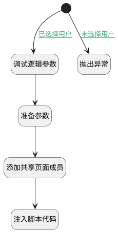

## 添加页面共享成员 <!-- {docsify-ignore-all} -->

   添加页面共享成员：非空间下成员

### 处理过程




### 处理步骤说明

#### 开始 :id=Begin<sup class="footnote-symbol"> <font color=gray size=1>[开始]</font></sup>


#### 抛出异常 :id=THROWEXCEPTION1<sup class="footnote-symbol"> <font color=gray size=1>[抛出异常]</font></sup>


> [!ATTENTION|label:抛出异常|icon:fa fa-warning]
> 错误信息：未选择用户

#### 调试逻辑参数 :id=DEBUGPARAM1<sup class="footnote-symbol"> <font color=gray size=1>[调试逻辑参数]</font></sup>


> [!NOTE|label:调试信息|icon:fa fa-bug]
> 调试输出参数`view`的详细信息

#### 准备参数 :id=PREPAREJSPARAM1<sup class="footnote-symbol"> <font color=gray size=1>[准备参数]</font></sup>


1. 将`ctx(应用上下文变量).article_page` 设置给  `Default(传入变量).shared_page`

#### 添加共享页面成员 :id=DEACTION1<sup class="footnote-symbol"> <font color=gray size=1>[实体行为]</font></sup>


调用实体 [成员(MEMBER)](module/Base/member.md) 行为 [添加共享页面非空间下成员(add_shared_page_member)](module/Base/member#行为) ，行为参数为`Default(传入变量)`

#### 注入脚本代码 :id=RAWJSCODE1<sup class="footnote-symbol"> <font color=gray size=1>[直接前台代码]</font></sup>


<p class="panel-title"><b>执行代码</b></p>

```javascript
view.layoutPanel.panelItems.choose_member.setDataValue(null);
```

### 连接条件说明
#### 已选择用户 :id=Begin-DEBUGPARAM1

```Default(传入变量).choose_member_ids``` ISNOTNULL
#### 未选择用户 :id=Begin-THROWEXCEPTION1

```Default(传入变量).choose_member_ids``` ISNULL


### 实体逻辑参数

|    中文名   |    代码名    |  数据类型      |备注 |
| --------| --------| --------  | --------   |
|应用上下文变量|ctx|导航视图参数绑定参数||
|view|view|当前视图对象||
|传入变量(<i class="fa fa-check"/></i>)|Default|数据对象||
