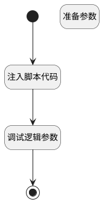

## 成员权限值变更 <!-- {docsify-ignore-all} -->

   

### 处理过程




### 处理步骤说明

#### 准备参数 :id=PREPAREJSPARAM1<sup class="footnote-symbol"> <font color=gray size=1>[准备参数]</font></sup>


1. 将`view.panelItems.check_type.value` 设置给  `view.context.check_type`
2. 将`view.panelItems.check_type.value` 设置给  `view.params.check_type`

#### 开始 :id=Begin<sup class="footnote-symbol"> <font color=gray size=1>[开始]</font></sup>


#### 结束 :id=END1<sup class="footnote-symbol"> <font color=gray size=1>[结束]</font></sup>


#### 注入脚本代码 :id=RAWJSCODE1<sup class="footnote-symbol"> <font color=gray size=1>[直接前台代码]</font></sup>


<p class="panel-title"><b>执行代码</b></p>

```javascript
const view = uiLogic.view;
const ctx = uiLogic.ctx;
ctx.check_type = view.panelItems.check_type.value;
view.context.check_type = view.panelItems.check_type.value;

```

#### 调试逻辑参数 :id=DEBUGPARAM1<sup class="footnote-symbol"> <font color=gray size=1>[调试逻辑参数]</font></sup>


> [!NOTE|label:调试信息|icon:fa fa-bug]
> 调试输出参数`ctx`的详细信息


### 实体逻辑参数

|    中文名   |    代码名    |  数据类型      |备注 |
| --------| --------| --------  | --------   |
|view|view|当前容器对象||
|ctx|ctx|导航视图参数绑定参数||
|传入变量(<i class="fa fa-check"/></i>)|Default|数据对象||
|check_type_value|check_type_value|数据对象||
