## 打开页面共享成员选择页（移动端） <!-- {docsify-ignore-all} -->

   打开页面共享成员选择页（移动端）

### 处理过程

```plantuml
@startuml
hide footbox
<style>
root {
  HyperlinkColor #42b983
}
</style>

hide empty description
state "开始" as Begin <<start>> [[$./open_choose_shared_member#begin {开始}]]
state "注入脚本代码" as RAWJSCODE1  [[$./open_choose_shared_member#rawjscode1 {注入脚本代码}]]
state "界面行为" as DEUIACTION1  [[$./open_choose_shared_member#deuiaction1 {界面行为}]]


Begin --> RAWJSCODE1
RAWJSCODE1 --> DEUIACTION1


@enduml
```




### 处理步骤说明

#### 开始 :id=Begin<sup class="footnote-symbol"> <font color=gray size=1>[开始]</font></sup>


#### 注入脚本代码 :id=RAWJSCODE1<sup class="footnote-symbol"> <font color=gray size=1>[直接前台代码]</font></sup>


<p class="panel-title"><b>执行代码</b></p>

```javascript
const check_type = view.layoutPanel.panelItems.check_type.value;
uiLogic.default.check_type = 'reader';
if(check_type) {
    uiLogic.default.check_type = check_type;
}
```

#### 界面行为 :id=DEUIACTION1<sup class="footnote-symbol"> <font color=gray size=1>[实体界面行为调用]</font></sup>


调用实体 [成员(MEMBER)](module/Base/member.md) 界面行为 [打开页面共享成员选择页（移动端）](module/Base/member#界面行为) ，行为参数为`Default(传入变量)`


### 实体逻辑参数

|    中文名   |    代码名    |  数据类型      |备注 |
| --------| --------| --------  | --------   |
|传入变量(<i class="fa fa-check"/></i>)|Default|数据对象||
