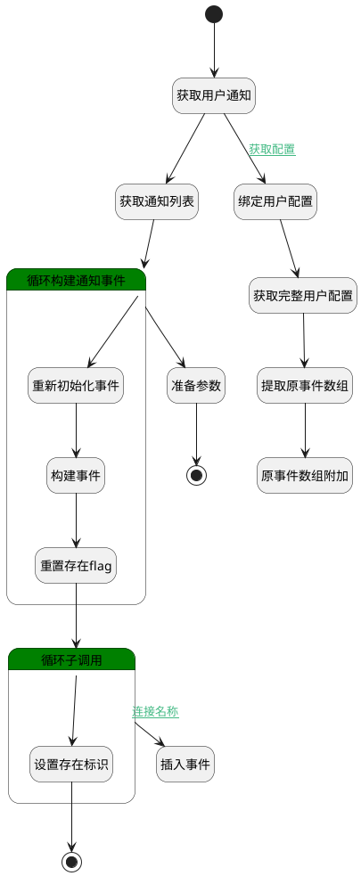

## 获取用户通知设置 <!-- {docsify-ignore-all} -->

   

### 处理过程




### 处理步骤说明

#### 开始 :id=Begin<sup class="footnote-symbol"> <font color=gray size=1>[开始]</font></sup>


*- N/A*
#### 获取用户通知 :id=DEDATASET1<sup class="footnote-symbol"> <font color=gray size=1>[实体数据集]</font></sup>


调用实体 [通知设置(NOTIFY_SETTING)](module/Base/notify_setting.md) 数据集合 [当前用户(CUR_USER)](module/Base/notify_setting#数据集合) ，查询参数为`notify_setting_filter(用户配置过滤项)`

将执行结果返回给参数`user_settings(用户配置列表)`

#### 获取通知列表 :id=DEDATASET2<sup class="footnote-symbol"> <font color=gray size=1>[实体数据集]</font></sup>


调用实体 [实体通知(PSDENOTIFY)](module/extension/PSDENotify.md) 数据集合 [数据集(DEFAULT)](module/extension/PSDENotify#数据集合) ，查询参数为`notify_filter(通知过滤器)`

将执行结果返回给参数`notifys(通知标识)`

#### 结束 :id=END1<sup class="footnote-symbol"> <font color=gray size=1>[结束]</font></sup>


返回 `user_setting(用户配置)`

#### 循环构建通知事件 :id=LOOPSUBCALL1<sup class="footnote-symbol"> <font color=gray size=1>[循环子调用]</font></sup>


循环参数`notifys(通知标识)`，子循环参数使用`notify(通知循环变量)`
#### 准备参数 :id=PREPAREPARAM2<sup class="footnote-symbol"> <font color=gray size=1>[准备参数]</font></sup>


1. 将`notify_events(通知事件列表)` 设置给  `user_setting(用户配置).SETTING_MODEL(设置模型)`

#### 绑定用户配置 :id=BINDPARAM1<sup class="footnote-symbol"> <font color=gray size=1>[绑定参数]</font></sup>


绑定参数`user_settings(用户配置列表)` 到 `user_setting(用户配置)`
#### 重新初始化事件 :id=RENEWPARAM1<sup class="footnote-symbol"> <font color=gray size=1>[重新建立参数]</font></sup>


重建参数```notify_event(通知事件)```
#### 构建事件 :id=PREPAREPARAM1<sup class="footnote-symbol"> <font color=gray size=1>[准备参数]</font></sup>


1. 将`notify(通知循环变量).PSDENOTIFYNAME(实体通知名称)` 设置给  `notify_event(通知事件).NAME(名称)`
2. 将`notify(通知循环变量).MSGTYPE(通知消息类型)` 设置给  `notify_event(通知事件).MSG_TYPE(消息类型)`
3. 将`notify(通知循环变量).PSDENOTIFYID(实体通知标识)` 设置给  `notify_event(通知事件).ID(标识)`

#### 获取完整用户配置 :id=DEACTION1<sup class="footnote-symbol"> <font color=gray size=1>[实体行为]</font></sup>


调用实体 [通知设置(NOTIFY_SETTING)](module/Base/notify_setting.md) 行为 [Get](module/Base/notify_setting#行为) ，行为参数为`user_setting(用户配置)`

#### 提取原事件数组 :id=BINDPARAM3<sup class="footnote-symbol"> <font color=gray size=1>[绑定参数]</font></sup>


绑定参数`user_setting(用户配置)` 到 `origin_events(原始配置事件)`
#### 重置存在flag :id=PREPAREPARAM4<sup class="footnote-symbol"> <font color=gray size=1>[准备参数]</font></sup>


1. 将`0` 设置给  `session_param(会话变量).exist_flag`

#### 原事件数组附加 :id=APPENDPARAM2<sup class="footnote-symbol"> <font color=gray size=1>[附加到数组参数]</font></sup>


将参数`origin_events(原始配置事件)` 添加到数组参数`notify_events(通知事件列表)`
#### 循环子调用 :id=LOOPSUBCALL2<sup class="footnote-symbol"> <font color=gray size=1>[循环子调用]</font></sup>


循环参数`notify_events(通知事件列表)`，子循环参数使用`loop_event(循环提取事件)`
#### 插入事件 :id=APPENDPARAM1<sup class="footnote-symbol"> <font color=gray size=1>[附加到数组参数]</font></sup>


将参数`notify_event(通知事件)` 添加到数组参数`notify_events(通知事件列表)`
#### 设置存在标识 :id=PREPAREPARAM3<sup class="footnote-symbol"> <font color=gray size=1>[准备参数]</font></sup>


1. 将`1` 设置给  `session_param(会话变量).exist_flag`

#### 结束 :id=END2<sup class="footnote-symbol"> <font color=gray size=1>[结束]</font></sup>


返回 `跳出循环（BREAK）`


### 连接条件说明
#### 获取配置 :id=DEDATASET1-BINDPARAM1

`user_settings(用户配置列表).size` GT `0`
#### 循环 


#### 连接名称 :id=LOOPSUBCALL2-APPENDPARAM1

`session_param(会话变量).exist_flag` NOTEQ `1`


### 实体逻辑参数

|    中文名   |    代码名    |  数据类型    |  实体   |备注 |
| --------| --------| -------- | -------- | --------   |
|传入变量(<i class="fa fa-check"/></i>)|Default|数据对象|[通知设置(NOTIFY_SETTING)](module/Base/notify_setting.md)||
|上下文|context||||
|循环提取事件|loop_event|数据对象|[通知事件(NOTIFY_EVENT)](module/extension/notify_event.md)||
|通知循环变量|notify|数据对象|[实体通知(PSDENOTIFY)](module/extension/PSDENotify.md)||
|通知事件|notify_event|数据对象|[通知事件(NOTIFY_EVENT)](module/extension/notify_event.md)||
|通知事件列表|notify_events|数据对象列表|[通知事件(NOTIFY_EVENT)](module/extension/notify_event.md)||
|通知过滤器|notify_filter|过滤器|||
|用户配置过滤项|notify_setting_filter|过滤器|||
|通知标识|notifys|分页查询|||
|原始配置事件|origin_events|数据对象列表|[通知事件(NOTIFY_EVENT)](module/extension/notify_event.md)||
|会话变量|session_param|会话变量|||
|用户配置|user_setting|数据对象|[通知设置(NOTIFY_SETTING)](module/Base/notify_setting.md)||
|用户配置列表|user_settings|分页查询|||
