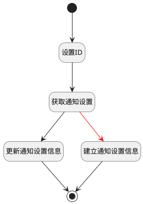

## 保存设置 <!-- {docsify-ignore-all} -->

   保存通知设置

### 处理过程

### 处理步骤说明

#### 开始 :id=Begin [开始]

*- N/A*
#### 设置ID :id=PREPAREPARAM1 [准备参数]

1. 将`Default(传入变量).ID(标识)` 设置给  `check_obj(检查对象).ID(标识)`

#### 获取通知设置 :id=DEACTION3 [实体行为]

调用实体 [通知设置(NOTIFY_SETTING)](module/Base/notify_setting.md) 行为 [Get](module/Base/notify_setting#行为) ，行为参数为`check_obj(检查对象)`

#### 更新通知设置信息 :id=DEACTION1 [实体行为]

调用实体 [通知设置(NOTIFY_SETTING)](module/Base/notify_setting.md) 行为 [Update](module/Base/notify_setting#行为) ，行为参数为`Default(传入变量)`

#### 结束 :id=END1 [结束]

*- N/A*

#### 建立通知设置信息 :id=DEACTION2 [实体行为]

调用实体 [通知设置(NOTIFY_SETTING)](module/Base/notify_setting.md) 行为 [Create](module/Base/notify_setting#行为) ，行为参数为`Default(传入变量)`

### 实体逻辑参数

|    中文名   |    代码名    |  数据类型    |  实体   |备注 |
| --------| --------| -------- | -------- | --------   |
|传入变量(<i class="fa fa-check"/></i>)|Default|数据对象|[通知设置(NOTIFY_SETTING)](module/Base/notify_setting.md)||
|检查对象|check_obj|数据对象|[通知设置(NOTIFY_SETTING)](module/Base/notify_setting.md)||
|上下文|context||||
