## 删除项目集 <!-- {docsify-ignore-all} -->

   项目集数据的逻辑删除，修改项目集的是否删除属性值

### 处理过程

```plantuml
@startuml
hide empty description
<style>
root {
  HyperlinkColor #42b983
}
</style>

hide empty description
state "开始" as Begin <<start>> [[$./delete_project_set#begin {"开始"}]]
state "设置删除状态" as PREPAREPARAM1  [[$./delete_project_set#prepareparam1 {"设置删除状态"}]]
state "删除" as DEACTION1  [[$./delete_project_set#deaction1 {"删除"}]]


Begin --> PREPAREPARAM1
PREPAREPARAM1 --> DEACTION1


@enduml
```

### 处理步骤说明

#### 开始 :id=Begin [开始]

*- N/A*
#### 设置删除状态 :id=PREPAREPARAM1 [准备参数]

1. 将`1` 设置给  `Default(传入变量).IS_DELETED(是否已删除)`

#### 删除 :id=DEACTION1 [实体行为]

调用实体 [文件夹(PORTFOLIO)](module/Base/portfolio.md) 行为 [Update](module/Base/portfolio#行为) ，行为参数为`Default(传入变量)`

### 实体逻辑参数

|    中文名   |    代码名    |  数据类型    |  实体   |备注 |
| --------| --------| -------- | -------- | --------   |
|传入变量(<i class="fa fa-check"/></i>)|Default|数据对象|[文件夹(PORTFOLIO)](module/Base/portfolio.md)||
