## 是否删除变更附加逻辑 <!-- {docsify-ignore-all} -->

   项目集删除或恢复时触发相应的通知消息

### 处理过程

```plantuml
@startuml
hide empty description
<style>
root {
  HyperlinkColor #42b983
}
</style>

hide empty description
state "开始" as Begin <<start>> [[$./is_deleted_onchange#begin {"开始"}]]
state "项目集归档/恢复通知" as DENOTIFY1  [[$./is_deleted_onchange#denotify1 {"项目集归档/恢复通知"}]]


Begin --> DENOTIFY1


@enduml
```

### 处理步骤说明

#### 开始 :id=Begin [开始]

*- N/A*
#### 项目集归档/恢复通知 :id=DENOTIFY1 [实体通知]

调用实体 [文件夹(PORTFOLIO)](module/Base/portfolio.md) 通知 [项目集归档/恢复通知(project_set_remove_recover_notify)](module/Base/portfolio/notify/project_set_remove_recover_notify) ，参数为`Default(传入变量)`

### 实体逻辑参数

|    中文名   |    代码名    |  数据类型    |  实体   |备注 |
| --------| --------| -------- | -------- | --------   |
|传入变量(<i class="fa fa-check"/></i>)|Default|数据对象|[文件夹(PORTFOLIO)](module/Base/portfolio.md)||
