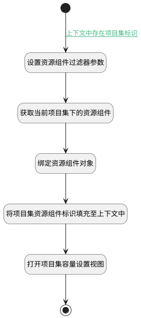

## 打开项目集资源容量设置 <!-- {docsify-ignore-all} -->

   根据当前项目集标识，获取项目集下的资源组件

### 处理过程




### 处理步骤说明

#### 开始 :id=Begin<sup class="footnote-symbol"> <font color=gray size=1>[开始]</font></sup>


#### 设置资源组件过滤器参数 :id=PREPAREJSPARAM1<sup class="footnote-symbol"> <font color=gray size=1>[准备参数]</font></sup>


1. 将`portfolio` 设置给  `addon_resource_filter(资源组件过滤器).n_owner_type_eq`
2. 将`resource` 设置给  `addon_resource_filter(资源组件过滤器).n_addon_type_eq`
3. 将`ctx(上下文).portfolio` 设置给  `addon_resource_filter(资源组件过滤器).n_owner_id_eq`

#### 获取当前项目集下的资源组件 :id=DEDATASET1<sup class="footnote-symbol"> <font color=gray size=1>[实体数据集]</font></sup>


#### 绑定资源组件对象 :id=BINDPARAM1<sup class="footnote-symbol"> <font color=gray size=1>[绑定参数]</font></sup>


绑定参数`addon_resource_page(资源组件分页查询结果变量)` 到 `addon_resource(当前项目下的资源组件)`
#### 将项目集资源组件标识填充至上下文中 :id=PREPAREJSPARAM2<sup class="footnote-symbol"> <font color=gray size=1>[准备参数]</font></sup>


1. 将`addon_resource(当前项目下的资源组件).id` 设置给  `ctx(上下文).addon_resource`

#### 打开项目集容量设置视图 :id=DEUIACTION1<sup class="footnote-symbol"> <font color=gray size=1>[实体界面行为调用]</font></sup>


调用实体 [文件夹(PORTFOLIO)](module/Base/portfolio.md) 界面行为 [打开项目集容量设置视图](module/Base/portfolio#界面行为) ，行为参数为`ctx(上下文)`

#### 结束 :id=END1<sup class="footnote-symbol"> <font color=gray size=1>[结束]</font></sup>


### 连接条件说明
#### 上下文中存在项目集标识 :id=Begin-PREPAREJSPARAM1

```ctx(上下文).portfolio``` ISNOTNULL


### 实体逻辑参数

|    中文名   |    代码名    |  数据类型      |备注 |
| --------| --------| --------  | --------   |
|当前项目下的资源组件|addon_resource|数据对象||
|上下文|ctx|导航视图参数绑定参数||
|资源组件分页查询结果变量|addon_resource_page|分页查询||
|传入变量(<i class="fa fa-check"/></i>)|Default|数据对象||
|资源组件过滤器|addon_resource_filter|过滤器||
