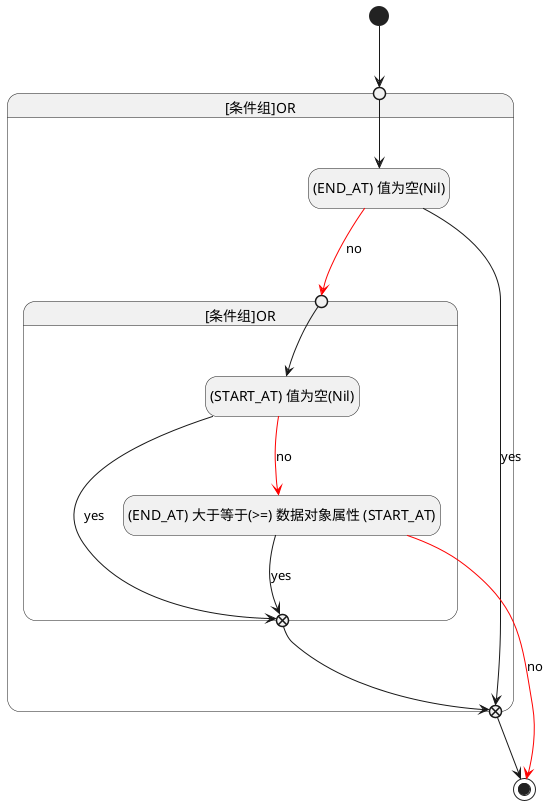

## 结束时间(END_AT) <!-- {docsify-ignore-all} -->

   

### 结束时间 :id=END_AT

#### 条件说明

##### (END_AT) 值为空(Nil) :id=ade62a9e02524ec3d95d164d76b6fd4e6

`END_AT(结束时间)` ISNULL 

##### (START_AT) 值为空(Nil) :id=ab949bda3a0e06b912952b7841cc8aa10

`START_AT(开始时间)` ISNULL 

##### (END_AT) 大于等于(>=) 数据对象属性 (START_AT) :id=ac678be8cf925fd1b084d8d0a473551ae

`END_AT(结束时间)` GTANDEQ  `START_AT`

> [!ATTENTION|label:规则信息|icon:fa fa-warning]
> 结束时间必须大于等于开始时间

